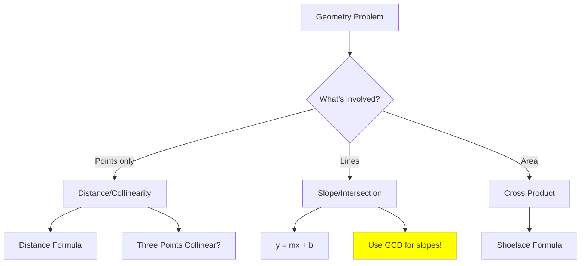

# Points and Lines

> **Computational geometry fundamentals for coding interviews.**
>
> Points, distances, collinearity, and line equations form the foundation.

---

## 🎯 Pattern Recognition



**Recognize these signals:**
- "Points on a plane"
- "Distance between points"
- "Points on a line"
- "Slope of line"
- "Intersection of lines"

---

## 📐 Fundamental Formulas

### Distance Between Two Points

$$d = \sqrt{(x_2 - x_1)^2 + (y_2 - y_1)^2}$$

```python
import math

def distance(p1: tuple[int, int], p2: tuple[int, int]) -> float:
    """Euclidean distance between two points."""
    return math.sqrt((p2[0] - p1[0])**2 + (p2[1] - p1[1])**2)


def distance_squared(p1: tuple[int, int], p2: tuple[int, int]) -> int:
    """
    Squared distance - PREFER THIS to avoid floating point!
    """
    return (p2[0] - p1[0])**2 + (p2[1] - p1[1])**2


# Example
p1, p2 = (0, 0), (3, 4)
print(distance(p1, p2))          # 5.0
print(distance_squared(p1, p2))  # 25
```

```javascript
function distance(p1, p2) {
    return Math.sqrt((p2[0] - p1[0]) ** 2 + (p2[1] - p1[1]) ** 2);
}

function distanceSquared(p1, p2) {
    // Prefer this to avoid floating point errors
    return (p2[0] - p1[0]) ** 2 + (p2[1] - p1[1]) ** 2;
}
```

---

### Manhattan Distance

$$d_{manhattan} = |x_2 - x_1| + |y_2 - y_1|$$

```python
def manhattan_distance(p1: tuple[int, int], p2: tuple[int, int]) -> int:
    """Manhattan (taxicab) distance."""
    return abs(p2[0] - p1[0]) + abs(p2[1] - p1[1])
```

---

### Slope of a Line

$$slope = \frac{y_2 - y_1}{x_2 - x_1}$$

**⚠️ IMPORTANT:** Use GCD representation to avoid floating point errors!

```python
from math import gcd

def get_slope(p1: tuple[int, int], p2: tuple[int, int]) -> tuple[int, int]:
    """
    Return slope as reduced fraction (dy, dx).
    
    CRITICAL: Use GCD to normalize!
    
    Returns:
        (dy, dx) where dy/dx is the slope in lowest terms.
        Special cases:
        - Vertical line: (1, 0)
        - Horizontal line: (0, 1)
    """
    dx = p2[0] - p1[0]
    dy = p2[1] - p1[1]
    
    if dx == 0:  # Vertical line
        return (1, 0)
    if dy == 0:  # Horizontal line
        return (0, 1)
    
    # Normalize: make sure dx is positive for consistent hashing
    if dx < 0:
        dx, dy = -dx, -dy
    
    g = gcd(abs(dx), abs(dy))
    return (dy // g, dx // g)


# Same slope:
print(get_slope((0, 0), (2, 4)))   # (2, 1)
print(get_slope((0, 0), (1, 2)))   # (2, 1)
print(get_slope((1, 1), (3, 5)))   # (2, 1)
```

```javascript
function gcd(a, b) {
    return b === 0 ? a : gcd(b, a % b);
}

function getSlope(p1, p2) {
    let dx = p2[0] - p1[0];
    let dy = p2[1] - p1[1];
    
    if (dx === 0) return [1, 0];  // Vertical
    if (dy === 0) return [0, 1];  // Horizontal
    
    if (dx < 0) {
        dx = -dx;
        dy = -dy;
    }
    
    const g = gcd(Math.abs(dx), Math.abs(dy));
    return [dy / g, dx / g];
}
```

---

### Collinearity (Three Points on Same Line)

Three points A, B, C are collinear if the slopes AB and BC are equal.

**Cross product method (avoids division):**

$$(B_x - A_x)(C_y - A_y) = (C_x - A_x)(B_y - A_y)$$

```python
def are_collinear(a: tuple[int, int], b: tuple[int, int], c: tuple[int, int]) -> bool:
    """
    Check if three points are collinear using cross product.
    
    Cross product = 0 means vectors AB and AC are parallel.
    
    Time: O(1)
    """
    # Vector AB = (b[0] - a[0], b[1] - a[1])
    # Vector AC = (c[0] - a[0], c[1] - a[1])
    # Cross product = AB.x * AC.y - AB.y * AC.x
    
    return (b[0] - a[0]) * (c[1] - a[1]) == (c[0] - a[0]) * (b[1] - a[1])


print(are_collinear((0, 0), (1, 1), (2, 2)))   # True
print(are_collinear((0, 0), (1, 1), (2, 3)))   # False
```

---

## 💻 LeetCode 149: Max Points on a Line

**Problem:** Find the maximum number of points on the same line.

```python
from collections import defaultdict
from math import gcd

def maxPoints(points: list[list[int]]) -> int:
    """
    LeetCode 149: Max Points on a Line
    
    Approach:
    1. For each point, compute slope to all other points
    2. Group by normalized slope
    3. Track max count for any slope from this point
    
    Time: O(n²)
    Space: O(n)
    """
    n = len(points)
    if n <= 2:
        return n
    
    max_count = 2
    
    for i in range(n):
        slope_count = defaultdict(int)
        
        for j in range(n):
            if i == j:
                continue
            
            slope = get_slope_tuple(points[i], points[j])
            slope_count[slope] += 1
            max_count = max(max_count, slope_count[slope] + 1)  # +1 for point i
    
    return max_count


def get_slope_tuple(p1: list[int], p2: list[int]) -> tuple[int, int]:
    """Get normalized slope as (dy, dx) tuple for hashing."""
    dx = p2[0] - p1[0]
    dy = p2[1] - p1[1]
    
    if dx == 0:
        return (1, 0)  # Vertical
    if dy == 0:
        return (0, 1)  # Horizontal
    
    # Normalize sign
    if dx < 0:
        dx, dy = -dx, -dy
    
    g = gcd(abs(dx), abs(dy))
    return (dy // g, dx // g)


# Test
points = [[1,1],[2,2],[3,3]]
print(maxPoints(points))  # 3

points = [[1,1],[3,2],[5,3],[4,1],[2,3],[1,4]]
print(maxPoints(points))  # 4
```

```javascript
function maxPoints(points) {
    const n = points.length;
    if (n <= 2) return n;
    
    let maxCount = 2;
    
    for (let i = 0; i < n; i++) {
        const slopeCount = new Map();
        
        for (let j = 0; j < n; j++) {
            if (i === j) continue;
            
            const slope = getSlopeKey(points[i], points[j]);
            const count = (slopeCount.get(slope) || 0) + 1;
            slopeCount.set(slope, count);
            maxCount = Math.max(maxCount, count + 1);
        }
    }
    
    return maxCount;
}

function getSlopeKey(p1, p2) {
    let dx = p2[0] - p1[0];
    let dy = p2[1] - p1[1];
    
    if (dx === 0) return "1,0";
    if (dy === 0) return "0,1";
    
    if (dx < 0) {
        dx = -dx;
        dy = -dy;
    }
    
    const g = gcd(Math.abs(dx), Math.abs(dy));
    return `${dy / g},${dx / g}`;
}

function gcd(a, b) {
    return b === 0 ? a : gcd(b, a % b);
}
```

---

## 💻 LeetCode 1232: Check If It Is a Straight Line

```python
def checkStraightLine(coordinates: list[list[int]]) -> bool:
    """
    LeetCode 1232: Check If It Is a Straight Line
    
    Check if all points are collinear.
    Use first two points to define the line, check all others.
    
    Time: O(n)
    Space: O(1)
    """
    if len(coordinates) <= 2:
        return True
    
    x0, y0 = coordinates[0]
    x1, y1 = coordinates[1]
    
    # For all other points, check collinearity with first two
    for i in range(2, len(coordinates)):
        xi, yi = coordinates[i]
        # Cross product should be 0
        if (x1 - x0) * (yi - y0) != (xi - x0) * (y1 - y0):
            return False
    
    return True


# Test
print(checkStraightLine([[1,2],[2,3],[3,4],[4,5],[5,6],[6,7]]))  # True
print(checkStraightLine([[1,1],[2,2],[3,4],[4,5]]))  # False
```

---

## 📊 Line Representations

### Slope-Intercept Form: y = mx + b

```python
def line_from_two_points_slope_intercept(p1, p2):
    """
    Returns (m, b) for y = mx + b.
    Returns (None, x) for vertical lines (x = constant).
    """
    if p2[0] == p1[0]:  # Vertical line
        return (None, p1[0])
    
    m = (p2[1] - p1[1]) / (p2[0] - p1[0])
    b = p1[1] - m * p1[0]
    return (m, b)
```

### General Form: ax + by + c = 0

More robust, avoids vertical line special cases:

```python
def line_from_two_points_general(p1, p2) -> tuple[int, int, int]:
    """
    Returns (a, b, c) for ax + by + c = 0.
    Normalized so gcd(|a|, |b|, |c|) = 1 and first non-zero is positive.
    """
    from math import gcd
    from functools import reduce
    
    a = p2[1] - p1[1]  # dy
    b = p1[0] - p2[0]  # -dx
    c = p2[0] * p1[1] - p1[0] * p2[1]
    
    # Normalize
    g = reduce(gcd, [abs(a), abs(b), abs(c)])
    if g > 0:
        a, b, c = a // g, b // g, c // g
    
    # Make first non-zero positive
    if a < 0 or (a == 0 and b < 0):
        a, b, c = -a, -b, -c
    
    return (a, b, c)
```

---

## 📐 Line Intersection

```python
def line_intersection(l1: tuple, l2: tuple) -> tuple | None:
    """
    Find intersection of two lines in general form.
    
    l1: (a1, b1, c1) for a1*x + b1*y + c1 = 0
    l2: (a2, b2, c2) for a2*x + b2*y + c2 = 0
    
    Returns (x, y) or None if parallel.
    """
    a1, b1, c1 = l1
    a2, b2, c2 = l2
    
    det = a1 * b2 - a2 * b1
    
    if det == 0:
        return None  # Parallel lines
    
    x = (b1 * c2 - b2 * c1) / det
    y = (a2 * c1 - a1 * c2) / det
    
    return (x, y)
```

---

## ⚠️ Common Mistakes

### 1. Floating Point Comparison

```python
# ❌ WRONG - floating point errors
if slope1 == slope2:  # 0.333... vs 0.333...

# ✅ CORRECT - use GCD-normalized fractions
if slope_fraction1 == slope_fraction2:  # (1, 3) == (1, 3)

# ✅ CORRECT - use cross product
if (dx1 * dy2 == dx2 * dy1):  # Integer comparison
```

### 2. Division by Zero (Vertical Lines)

```python
# ❌ WRONG - crashes on vertical lines
slope = dy / dx  # dx might be 0!

# ✅ CORRECT - handle vertical separately
if dx == 0:
    slope = (1, 0)  # Special marker for vertical
else:
    slope = (dy // g, dx // g)
```

### 3. Inconsistent Slope Sign

```python
# ❌ WRONG - (1, -2) and (-1, 2) are same slope but different tuples
return (dy // g, dx // g)

# ✅ CORRECT - normalize so dx is always positive
if dx < 0:
    dx, dy = -dx, -dy
return (dy // g, dx // g)
```

### 4. Forgetting Duplicate Points

```python
# ❌ WRONG - doesn't handle same point appearing twice
for j in range(n):
    if points[i] == points[j]:  # Same coordinates!
        continue  # Need to count these differently!
```

---

## ⚡ Complexity Analysis

| Operation | Time | Space |
|-----------|------|-------|
| Distance | O(1) | O(1) |
| Collinearity check | O(1) | O(1) |
| Max Points on Line | O(n²) | O(n) |
| Line intersection | O(1) | O(1) |

---

## ✅ When to Use

| Scenario | Technique |
|----------|-----------|
| Compare distances | Squared distance (avoid sqrt) |
| Check collinearity | Cross product (avoid division) |
| Group by slope | GCD-normalized fraction |
| Find intersection | General form (ax + by + c = 0) |

## ❌ When NOT to Use

| Scenario | Issue |
|----------|-------|
| Need exact float coordinates | Use rational numbers or tolerance |
| Large coordinate values | Watch for overflow in cross product |

---

## 📝 Practice Problems

| Problem | Difficulty | Key Technique |
|---------|------------|---------------|
| [Max Points on a Line](https://leetcode.com/problems/max-points-on-a-line/) | 🔴 Hard | GCD slope, hash map |
| [Check If Straight Line](https://leetcode.com/problems/check-if-it-is-a-straight-line/) | 🟢 Easy | Cross product |
| [Minimum Time Visiting Points](https://leetcode.com/problems/minimum-time-visiting-all-points/) | 🟢 Easy | Chebyshev distance |

---

## 🎤 Interview Context

<details>
<summary><strong>How to Communicate</strong></summary>

**On floating point issues:**
> "Instead of computing slopes as floats, I'll represent them as reduced fractions using GCD. This avoids floating point comparison issues."

**On the approach:**
> "I'll iterate through each point and group all other points by their slope relative to it. The maximum count for any slope, plus one for the base point, gives me the answer."

**Company Frequency:**
| Company | Frequency | Notes |
|---------|-----------|-------|
| Meta | ⭐⭐⭐ | Max Points on a Line |
| Google | ⭐⭐ | Geometry problems |
| Amazon | ⭐⭐ | Less common |

</details>

---

## ⏱️ Time Estimates

| Activity | Time |
|----------|------|
| Basic formulas | 15 min |
| GCD slope trick | 20 min |
| Max Points on Line | 30 min |
| Master geometry | 2 hours |

---

## 🧠 Spaced Repetition

<details>
<summary><strong>Review Schedule</strong></summary>

- **Day 1:** Implement distance and collinearity formulas
- **Day 3:** Explain why GCD-normalized slopes avoid floating point issues
- **Day 7:** Solve Max Points on a Line
- **Day 14:** Handle vertical line edge cases
- **Day 30:** Combine with other geometry problems

</details>

---

> **💡 Key Insight:** The main trick in line problems is representing slopes as GCD-normalized fractions (dy/g, dx/g) instead of floats. This makes comparison and hashing reliable. For collinearity, use cross product to avoid division entirely.

> **🔗 Related:** [GCD](../02-GCD-LCM/2.1-Euclidean-Algorithm.md) | [Rectangle Problems →](./6.2-Rectangle-Problems.md) | [Hash Maps](../../01-Arrays-Strings/03-Hashing/3.1-Hash-Maps.md)
