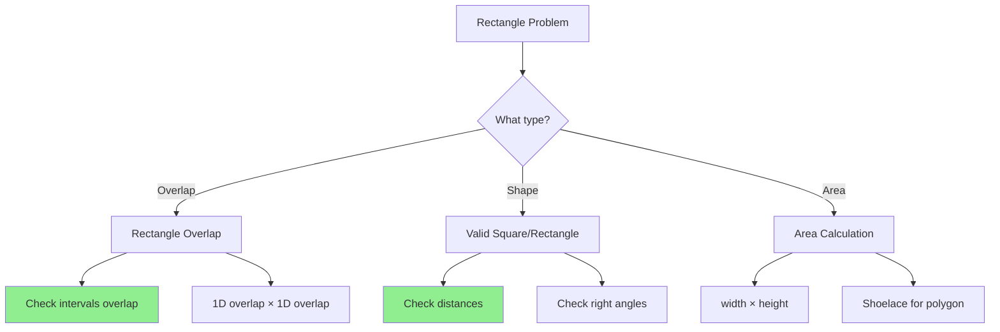

# Rectangle Problems

> **Common interview geometry problems involving rectangles and squares.**
>
> Key techniques: coordinate validation, overlap detection, and distance comparisons.

---

## 🎯 Pattern Recognition



**Common problem types:**
- Rectangle overlap/intersection
- Valid square detection
- Area of union/intersection
- Point in rectangle
- Minimum bounding rectangle

---

## 📐 Rectangle Representation

### Two-Point Representation (x1, y1, x2, y2)

Most common in LeetCode:
- (x1, y1): bottom-left corner
- (x2, y2): top-right corner

```python
class Rectangle:
    def __init__(self, x1: int, y1: int, x2: int, y2: int):
        self.x1 = x1  # left
        self.y1 = y1  # bottom
        self.x2 = x2  # right
        self.y2 = y2  # top
    
    @property
    def width(self) -> int:
        return self.x2 - self.x1
    
    @property
    def height(self) -> int:
        return self.y2 - self.y1
    
    @property
    def area(self) -> int:
        return self.width * self.height
```

---

## 💻 LeetCode 836: Rectangle Overlap

**Problem:** Given two axis-aligned rectangles, return true if they overlap.

```python
def isRectangleOverlap(rec1: list[int], rec2: list[int]) -> bool:
    """
    LeetCode 836: Rectangle Overlap
    
    Two rectangles overlap iff:
    - Their x-intervals overlap AND
    - Their y-intervals overlap
    
    Intervals [a1, a2] and [b1, b2] overlap iff:
        a1 < b2 AND b1 < a2
    
    Time: O(1)
    Space: O(1)
    """
    x1, y1, x2, y2 = rec1
    x3, y3, x4, y4 = rec2
    
    # Check if x-intervals overlap AND y-intervals overlap
    x_overlap = x1 < x4 and x3 < x2
    y_overlap = y1 < y4 and y3 < y2
    
    return x_overlap and y_overlap


# Alternative: check for NO overlap, then negate
def isRectangleOverlap_v2(rec1: list[int], rec2: list[int]) -> bool:
    """
    Check if rectangles DON'T overlap (easier to think about):
    - rec1 is completely to the left of rec2
    - rec1 is completely to the right of rec2
    - rec1 is completely above rec2
    - rec1 is completely below rec2
    """
    x1, y1, x2, y2 = rec1
    x3, y3, x4, y4 = rec2
    
    no_overlap = (x2 <= x3 or  # rec1 is left of rec2
                  x4 <= x1 or  # rec1 is right of rec2
                  y2 <= y3 or  # rec1 is below rec2
                  y4 <= y1)    # rec1 is above rec2
    
    return not no_overlap


# Tests
print(isRectangleOverlap([0,0,2,2], [1,1,3,3]))  # True
print(isRectangleOverlap([0,0,1,1], [1,0,2,1]))  # False (touching edge)
print(isRectangleOverlap([0,0,1,1], [2,2,3,3]))  # False (separate)
```

```javascript
function isRectangleOverlap(rec1, rec2) {
    const [x1, y1, x2, y2] = rec1;
    const [x3, y3, x4, y4] = rec2;
    
    const xOverlap = x1 < x4 && x3 < x2;
    const yOverlap = y1 < y4 && y3 < y2;
    
    return xOverlap && yOverlap;
}
```

---

## 💻 LeetCode 223: Rectangle Area

**Problem:** Find the total area covered by two overlapping rectangles.

```python
def computeArea(ax1: int, ay1: int, ax2: int, ay2: int,
                bx1: int, by1: int, bx2: int, by2: int) -> int:
    """
    LeetCode 223: Rectangle Area
    
    Total Area = Area1 + Area2 - Intersection
    
    Time: O(1)
    Space: O(1)
    """
    area1 = (ax2 - ax1) * (ay2 - ay1)
    area2 = (bx2 - bx1) * (by2 - by1)
    
    # Calculate intersection
    # Overlap in x: [max(left), min(right)]
    # Overlap in y: [max(bottom), min(top)]
    overlap_x = max(0, min(ax2, bx2) - max(ax1, bx1))
    overlap_y = max(0, min(ay2, by2) - max(ay1, by1))
    intersection = overlap_x * overlap_y
    
    return area1 + area2 - intersection


# Test
print(computeArea(-3, 0, 3, 4, 0, -1, 9, 2))  # 45
```

---

## 💻 LeetCode 593: Valid Square

**Problem:** Given coordinates of four points, check if they form a square.

```python
def validSquare(p1: list[int], p2: list[int], 
                p3: list[int], p4: list[int]) -> bool:
    """
    LeetCode 593: Valid Square
    
    Strategy:
    1. Compute all 6 pairwise distances
    2. A valid square has exactly 4 equal sides and 2 equal diagonals
    3. Sides must be > 0 (not a point)
    4. Diagonal = Side × √2
    
    Time: O(1)
    Space: O(1)
    """
    def dist_sq(a, b):
        return (a[0] - b[0])**2 + (a[1] - b[1])**2
    
    points = [p1, p2, p3, p4]
    distances = []
    
    # Get all 6 pairwise distances
    for i in range(4):
        for j in range(i + 1, 4):
            distances.append(dist_sq(points[i], points[j]))
    
    distances.sort()
    
    # Should have: [side, side, side, side, diagonal, diagonal]
    # All sides equal, both diagonals equal, sides > 0
    # diagonal² = 2 × side²
    
    return (distances[0] > 0 and                    # Not a point
            distances[0] == distances[1] ==          # 4 equal sides
            distances[2] == distances[3] and
            distances[4] == distances[5] and         # 2 equal diagonals
            distances[4] == 2 * distances[0])        # d² = 2s²


# Test
print(validSquare([0,0], [1,1], [1,0], [0,1]))  # True
print(validSquare([0,0], [1,1], [1,0], [0,2]))  # False
print(validSquare([1,0], [-1,0], [0,1], [0,-1]))  # True
```

```javascript
function validSquare(p1, p2, p3, p4) {
    const distSq = (a, b) => (a[0] - b[0]) ** 2 + (a[1] - b[1]) ** 2;
    
    const points = [p1, p2, p3, p4];
    const distances = [];
    
    for (let i = 0; i < 4; i++) {
        for (let j = i + 1; j < 4; j++) {
            distances.push(distSq(points[i], points[j]));
        }
    }
    
    distances.sort((a, b) => a - b);
    
    return (distances[0] > 0 &&
            distances[0] === distances[1] &&
            distances[1] === distances[2] &&
            distances[2] === distances[3] &&
            distances[4] === distances[5] &&
            distances[4] === 2 * distances[0]);
}
```

---

## 📐 1D Interval Overlap

Many rectangle problems reduce to 1D interval problems.

```python
def interval_overlap(a1: int, a2: int, b1: int, b2: int) -> int:
    """
    Length of overlap between [a1, a2] and [b1, b2].
    Returns 0 if no overlap.
    """
    return max(0, min(a2, b2) - max(a1, b1))


def intervals_overlap(a1: int, a2: int, b1: int, b2: int) -> bool:
    """Check if intervals overlap (not just touch)."""
    return a1 < b2 and b1 < a2


def intervals_touch_or_overlap(a1: int, a2: int, b1: int, b2: int) -> bool:
    """Check if intervals overlap or share an endpoint."""
    return a1 <= b2 and b1 <= a2
```

---

## 💻 Rectangle Intersection

```python
def rectangle_intersection(rec1: list[int], rec2: list[int]) -> list[int] | None:
    """
    Find the intersecting rectangle.
    Returns [x1, y1, x2, y2] or None if no intersection.
    """
    x1, y1, x2, y2 = rec1
    x3, y3, x4, y4 = rec2
    
    # New rectangle bounds
    left = max(x1, x3)
    right = min(x2, x4)
    bottom = max(y1, y3)
    top = min(y2, y4)
    
    if left < right and bottom < top:
        return [left, bottom, right, top]
    return None


# Test
print(rectangle_intersection([0,0,3,3], [1,1,4,4]))  # [1,1,3,3]
print(rectangle_intersection([0,0,1,1], [2,2,3,3]))  # None
```

---

## 💻 Point in Rectangle

```python
def point_in_rectangle(px: int, py: int, 
                       x1: int, y1: int, x2: int, y2: int) -> bool:
    """
    Check if point (px, py) is inside rectangle [x1,y1,x2,y2].
    """
    return x1 <= px <= x2 and y1 <= py <= y2


def point_strictly_inside(px: int, py: int,
                          x1: int, y1: int, x2: int, y2: int) -> bool:
    """Check if point is strictly inside (not on boundary)."""
    return x1 < px < x2 and y1 < py < y2
```

---

## 📊 Minimum Bounding Rectangle

```python
def bounding_rectangle(points: list[list[int]]) -> list[int]:
    """
    Find the minimum axis-aligned bounding rectangle for a set of points.
    Returns [min_x, min_y, max_x, max_y].
    """
    if not points:
        return [0, 0, 0, 0]
    
    min_x = min(p[0] for p in points)
    max_x = max(p[0] for p in points)
    min_y = min(p[1] for p in points)
    max_y = max(p[1] for p in points)
    
    return [min_x, min_y, max_x, max_y]
```

---

## ⚠️ Common Mistakes

### 1. Confusing < vs <=

```python
# ❌ WRONG - includes touching edges as overlap
x_overlap = x1 <= x4 and x3 <= x2  # Touching = overlap

# ✅ CORRECT - strict inequality for proper overlap
x_overlap = x1 < x4 and x3 < x2
```

### 2. Wrong Corner Order

```python
# ❌ WRONG - assuming (x1,y1) is always bottom-left
# Some problems give top-left and bottom-right!

# ✅ CORRECT - normalize first
x1, x2 = min(x1, x2), max(x1, x2)
y1, y2 = min(y1, y2), max(y1, y2)
```

### 3. Integer Overflow in Distance

```python
# ❌ WRONG - might overflow for large coordinates
dist = (x2 - x1) ** 2 + (y2 - y1) ** 2  # Can be huge!

# ✅ CORRECT - use appropriate data types
# Python handles big integers, but in other languages use long
```

### 4. Not Checking Zero Area

```python
# ❌ WRONG - a line isn't a square
if all_distances_equal:
    return True

# ✅ CORRECT - check that side > 0
if distances[0] > 0 and all_sides_equal:
    return True
```

---

## ⚡ Complexity Analysis

| Operation | Time | Space |
|-----------|------|-------|
| Rectangle overlap check | O(1) | O(1) |
| Rectangle intersection | O(1) | O(1) |
| Valid square check | O(1) | O(1) |
| Bounding rectangle | O(n) | O(1) |

---

## ✅ When to Use

| Problem Type | Technique |
|--------------|-----------|
| Two rectangles overlap? | Interval overlap check |
| Area of union | Add areas - intersection |
| Valid shape detection | Distance checks |
| Point containment | Boundary comparison |

## ❌ When NOT to Use

| Scenario | Alternative |
|----------|-------------|
| Non-axis-aligned rectangles | Rotation + transformation |
| Arbitrary polygons | Convex hull / polygon algorithms |
| Floating point coordinates | Add tolerance for comparison |

---

## 📝 Practice Problems

| Problem | Difficulty | Key Technique |
|---------|------------|---------------|
| [Rectangle Overlap](https://leetcode.com/problems/rectangle-overlap/) | 🟢 Easy | Interval overlap |
| [Rectangle Area](https://leetcode.com/problems/rectangle-area/) | 🟡 Medium | Area - intersection |
| [Valid Square](https://leetcode.com/problems/valid-square/) | 🟡 Medium | Distance checks |
| [Rectangle Area II](https://leetcode.com/problems/rectangle-area-ii/) | 🔴 Hard | Line sweep |

---

## 🎤 Interview Context

<details>
<summary><strong>How to Communicate</strong></summary>

**On overlap approach:**
> "I'll check if the x-intervals overlap and y-intervals overlap separately. Two intervals [a,b] and [c,d] overlap if a < d and c < b."

**On valid square:**
> "For four points to form a square, we need 4 equal side lengths and 2 equal diagonal lengths, with the diagonal being √2 times the side. I'll compute all 6 pairwise distances."

**Company Frequency:**
| Company | Frequency | Notes |
|---------|-----------|-------|
| Meta | ⭐⭐⭐ | Rectangle problems |
| Google | ⭐⭐ | Geometry in general |
| Amazon | ⭐⭐ | Basic overlap |

</details>

---

## ⏱️ Time Estimates

| Activity | Time |
|----------|------|
| Rectangle overlap | 10 min |
| Valid square | 20 min |
| Rectangle area | 15 min |
| Master topic | 1 hour |

---

## 🧠 Spaced Repetition

<details>
<summary><strong>Review Schedule</strong></summary>

- **Day 1:** Implement rectangle overlap
- **Day 3:** Rectangle area with intersection
- **Day 7:** Valid square
- **Day 14:** Bounding rectangle
- **Day 30:** Rectangle Area II (hard)

</details>

---

> **💡 Key Insight:** Rectangle problems almost always reduce to 1D interval problems. For two rectangles to overlap, their x-projections AND y-projections must overlap. For shape validation, compare all pairwise distances.

> **🔗 Related:** [Points and Lines](./6.1-Points-Lines.md) | [Convex Hull →](./6.3-Convex-Hull.md) | [Interval Problems](../../01-Arrays-Strings/01-Arrays/1.4-Common-Techniques/02-Sliding-Window.md)
