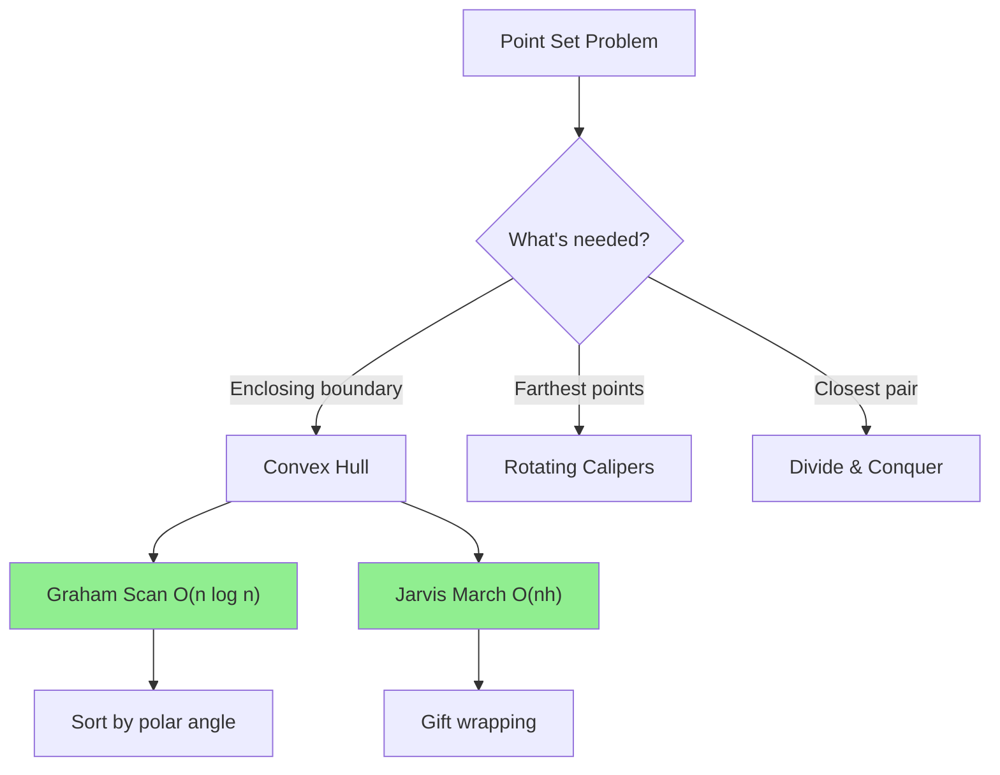

# Convex Hull

> **The smallest convex polygon that encloses all points.**
>
> Classic computational geometry algorithm used in graphics, GIS, and collision detection.

---

## 🎯 Pattern Recognition



**Use convex hull when:**
- Need to enclose points with minimum perimeter
- Finding boundary points of a point set
- Collision detection in games
- Computing farthest pair (rotating calipers)

---

## 📐 What is Convex Hull?

The **convex hull** of a set of points is the smallest convex polygon that contains all the points. 

Imagine stretching a rubber band around all the points - when released, it snaps to the convex hull.

```
Points:         Convex Hull:
   *                *
 *   *            /   \
  *         ->   *-----*
*    *           |     |
  *              *-----*
```

---

## 💻 Cross Product (Key Primitive)

The cross product tells us the turn direction:

```python
def cross_product(o: tuple, a: tuple, b: tuple) -> int:
    """
    Compute cross product of vectors OA and OB.
    
    Returns:
        > 0: Counter-clockwise (left turn)
        = 0: Collinear
        < 0: Clockwise (right turn)
    """
    return (a[0] - o[0]) * (b[1] - o[1]) - (a[1] - o[1]) * (b[0] - o[0])
```

**Visualization:**
```
     B
    /
   /   cross > 0 (CCW/left turn)
  O----A

  O----A
   \
    \  cross < 0 (CW/right turn)
     B
```

---

## 💻 Graham Scan Algorithm

**Idea:** Sort points by angle, then process in order, keeping only points that make left turns.

```python
def convex_hull_graham(points: list[list[int]]) -> list[list[int]]:
    """
    Graham Scan algorithm for convex hull.
    
    Time: O(n log n) - dominated by sorting
    Space: O(n)
    
    Returns points on hull in counter-clockwise order.
    """
    def cross(o, a, b):
        return (a[0] - o[0]) * (b[1] - o[1]) - (a[1] - o[1]) * (b[0] - o[0])
    
    # Remove duplicates and handle small cases
    points = sorted(set(map(tuple, points)))
    if len(points) <= 2:
        return points
    
    # Build lower hull
    lower = []
    for p in points:
        while len(lower) >= 2 and cross(lower[-2], lower[-1], p) <= 0:
            lower.pop()
        lower.append(p)
    
    # Build upper hull
    upper = []
    for p in reversed(points):
        while len(upper) >= 2 and cross(upper[-2], upper[-1], p) <= 0:
            upper.pop()
        upper.append(p)
    
    # Remove last point of each half (it's the first of the other)
    return lower[:-1] + upper[:-1]


# Test
points = [[1,1], [2,2], [2,0], [2,4], [3,3], [4,2]]
hull = convex_hull_graham(points)
print(hull)  # [(1, 1), (2, 0), (4, 2), (2, 4)]
```

```javascript
function convexHullGraham(points) {
    const cross = (o, a, b) => 
        (a[0] - o[0]) * (b[1] - o[1]) - (a[1] - o[1]) * (b[0] - o[0]);
    
    // Sort points
    points = [...new Set(points.map(p => p.join(',')))].map(s => s.split(',').map(Number));
    points.sort((a, b) => a[0] - b[0] || a[1] - b[1]);
    
    if (points.length <= 2) return points;
    
    // Build lower hull
    const lower = [];
    for (const p of points) {
        while (lower.length >= 2 && cross(lower[lower.length-2], lower[lower.length-1], p) <= 0) {
            lower.pop();
        }
        lower.push(p);
    }
    
    // Build upper hull
    const upper = [];
    for (let i = points.length - 1; i >= 0; i--) {
        const p = points[i];
        while (upper.length >= 2 && cross(upper[upper.length-2], upper[upper.length-1], p) <= 0) {
            upper.pop();
        }
        upper.push(p);
    }
    
    // Combine (remove duplicates at join points)
    return [...lower.slice(0, -1), ...upper.slice(0, -1)];
}
```

---

## 💻 Andrew's Monotone Chain

Same idea as Graham Scan, often considered cleaner implementation:

```python
def convex_hull_andrew(points: list[list[int]]) -> list[list[int]]:
    """
    Andrew's Monotone Chain algorithm.
    
    Same complexity as Graham Scan, but uses x-coordinate sorting
    instead of polar angle sorting (simpler).
    
    Time: O(n log n)
    Space: O(n)
    """
    def cross(o, a, b):
        return (a[0] - o[0]) * (b[1] - o[1]) - (a[1] - o[1]) * (b[0] - o[0])
    
    points = sorted(map(tuple, points))
    if len(points) <= 1:
        return list(points)
    
    # Build lower hull: left to right
    lower = []
    for p in points:
        while len(lower) >= 2 and cross(lower[-2], lower[-1], p) <= 0:
            lower.pop()
        lower.append(p)
    
    # Build upper hull: right to left
    upper = []
    for p in reversed(points):
        while len(upper) >= 2 and cross(upper[-2], upper[-1], p) <= 0:
            upper.pop()
        upper.append(p)
    
    return lower[:-1] + upper[:-1]
```

---

## 💻 Jarvis March (Gift Wrapping)

**Idea:** Start from leftmost point, always pick the point that makes the smallest counter-clockwise angle.

```python
def convex_hull_jarvis(points: list[list[int]]) -> list[list[int]]:
    """
    Jarvis March (Gift Wrapping) algorithm.
    
    Time: O(n*h) where h is the number of hull points
    Space: O(h)
    
    Better than Graham when h is small (output-sensitive).
    """
    def cross(o, a, b):
        return (a[0] - o[0]) * (b[1] - o[1]) - (a[1] - o[1]) * (b[0] - o[0])
    
    def dist_sq(a, b):
        return (a[0] - b[0])**2 + (a[1] - b[1])**2
    
    n = len(points)
    if n <= 2:
        return points
    
    points = list(map(tuple, points))
    
    # Find leftmost point
    start = min(range(n), key=lambda i: (points[i][0], points[i][1]))
    
    hull = []
    current = start
    
    while True:
        hull.append(points[current])
        next_point = 0
        
        for i in range(n):
            if i == current:
                continue
            
            # Check if i is more counter-clockwise than next_point
            cross_val = cross(points[current], points[next_point], points[i])
            
            if next_point == current or cross_val > 0:
                next_point = i
            elif cross_val == 0:
                # Collinear: pick the farthest
                if dist_sq(points[current], points[i]) > dist_sq(points[current], points[next_point]):
                    next_point = i
        
        current = next_point
        if current == start:
            break
    
    return hull


# Test
points = [[0,0], [1,1], [2,0], [2,2], [1,2], [0,2]]
print(convex_hull_jarvis(points))  # [(0, 0), (2, 0), (2, 2), (0, 2)]
```

---

## 📊 Algorithm Comparison

| Algorithm | Time | Space | Best When |
|-----------|------|-------|-----------|
| Graham Scan | O(n log n) | O(n) | General use |
| Andrew's Chain | O(n log n) | O(n) | Simple implementation |
| Jarvis March | O(n×h) | O(h) | Few hull points |
| Quickhull | O(n log n) avg | O(n) | Random distribution |

Where h = number of points on the hull.

---

## 💻 LeetCode 587: Erect the Fence

**Problem:** Given trees at positions, find the minimum rope to enclose all trees.

```python
def outerTrees(trees: list[list[int]]) -> list[list[int]]:
    """
    LeetCode 587: Erect the Fence
    
    Find convex hull (including collinear points on hull).
    
    Key difference: we need to INCLUDE collinear points on the boundary!
    """
    def cross(o, a, b):
        return (a[0] - o[0]) * (b[1] - o[1]) - (a[1] - o[1]) * (b[0] - o[0])
    
    trees = sorted(map(tuple, trees))
    if len(trees) <= 1:
        return [list(t) for t in trees]
    
    # Lower hull - strict (exclude collinear for now)
    lower = []
    for p in trees:
        while len(lower) >= 2 and cross(lower[-2], lower[-1], p) < 0:  # < not <=
            lower.pop()
        lower.append(p)
    
    # Upper hull - strict
    upper = []
    for p in reversed(trees):
        while len(upper) >= 2 and cross(upper[-2], upper[-1], p) < 0:  # < not <=
            upper.pop()
        upper.append(p)
    
    # Combine and remove duplicates
    hull = set(lower[:-1] + upper[:-1])
    return [list(p) for p in hull]


# Test
trees = [[1,1],[2,2],[2,0],[2,4],[3,3],[4,2]]
print(outerTrees(trees))
```

---

## 📐 Applications

### 1. Farthest Pair of Points (Rotating Calipers)

```python
def farthest_pair(points):
    """Find the two points with maximum distance."""
    hull = convex_hull_andrew(points)
    n = len(hull)
    
    if n <= 2:
        return 0 if n <= 1 else dist_sq(hull[0], hull[1])
    
    max_dist = 0
    j = 1
    
    for i in range(n):
        while True:
            d1 = dist_sq(hull[i], hull[j])
            d2 = dist_sq(hull[i], hull[(j + 1) % n])
            if d2 > d1:
                j = (j + 1) % n
            else:
                break
        max_dist = max(max_dist, dist_sq(hull[i], hull[j]))
    
    return max_dist
```

### 2. Area of Convex Hull (Shoelace Formula)

```python
def hull_area(hull: list[tuple]) -> float:
    """
    Compute area of convex polygon using Shoelace formula.
    Points should be in order (clockwise or counter-clockwise).
    """
    n = len(hull)
    if n < 3:
        return 0
    
    area = 0
    for i in range(n):
        j = (i + 1) % n
        area += hull[i][0] * hull[j][1]
        area -= hull[j][0] * hull[i][1]
    
    return abs(area) / 2


# Test
hull = [(0, 0), (4, 0), (4, 3), (0, 3)]
print(hull_area(hull))  # 12.0
```

---

## ⚠️ Common Mistakes

### 1. Wrong Turn Direction

```python
# ❌ WRONG - confusing CW and CCW
while cross(...) > 0:  # Might be backwards!

# ✅ CORRECT - consistent convention
# For lower hull left-to-right: remove if NOT left turn (cross <= 0)
# For upper hull right-to-left: remove if NOT left turn (cross <= 0)
while cross(...) <= 0:
    stack.pop()
```

### 2. Not Handling Collinear Points

```python
# ❌ WRONG - excludes collinear boundary points
while cross(...) < 0:  # Only strict right turns

# ✅ CORRECT for including boundary
while cross(...) < 0:  # Keep collinear points
# Or:
while cross(...) <= 0:  # Exclude collinear points
```

### 3. Duplicate Points

```python
# ❌ WRONG - duplicates cause issues
points = [(0,0), (1,1), (0,0), (2,2)]  # Has duplicate!

# ✅ CORRECT - remove duplicates first
points = list(set(map(tuple, points)))
```

### 4. Not Sorting

```python
# ❌ WRONG - Graham scan requires sorted input
for p in points:  # Random order!

# ✅ CORRECT - sort by x (then y for ties)
points = sorted(points)
```

---

## ⚡ Complexity Analysis

| Algorithm | Time | Space | Notes |
|-----------|------|-------|-------|
| Graham Scan | O(n log n) | O(n) | Sorting dominates |
| Jarvis March | O(n×h) | O(h) | Output-sensitive |
| Quickhull | O(n log n) avg | O(n) | O(n²) worst |

**Why O(n log n)?**
- Sorting: O(n log n)
- Building hull: O(n) - each point pushed/popped once

---

## ✅ When to Use

| Algorithm | Best For |
|-----------|----------|
| Graham/Andrew | General purpose, O(n log n) guaranteed |
| Jarvis March | Few hull points (h << n) |
| Quickhull | Practical for random distributions |

## ❌ When NOT to Use

| Scenario | Alternative |
|----------|-------------|
| Online points (streaming) | Dynamic convex hull |
| 3D points | 3D convex hull algorithms |
| Need interior points too | Different algorithm |

---

## 📝 Practice Problems

| Problem | Difficulty | Key Technique |
|---------|------------|---------------|
| [Erect the Fence](https://leetcode.com/problems/erect-the-fence/) | 🔴 Hard | Convex hull |
| [Max Points on a Line](https://leetcode.com/problems/max-points-on-a-line/) | 🔴 Hard | Related (collinearity) |

---

## 🎤 Interview Context

<details>
<summary><strong>How to Communicate</strong></summary>

**Explaining the algorithm:**
> "I'll use Graham Scan. First sort by x-coordinate, then build lower and upper hulls separately. For each new point, I remove points that would make a clockwise turn."

**On complexity:**
> "Sorting is O(n log n). The hull building is O(n) since each point is pushed and popped at most once. Total: O(n log n)."

**Company Frequency:**
| Company | Frequency | Notes |
|---------|-----------|-------|
| Google | ⭐⭐ | Geometry problems |
| Gaming | ⭐⭐⭐ | Collision detection |
| GIS | ⭐⭐⭐ | Boundary computation |

</details>

---

## ⏱️ Time Estimates

| Activity | Time |
|----------|------|
| Understand cross product | 15 min |
| Implement Graham Scan | 30 min |
| Handle edge cases | 20 min |
| Master topic | 2 hours |

---

## 🧠 Spaced Repetition

<details>
<summary><strong>Review Schedule</strong></summary>

- **Day 1:** Understand cross product turn direction
- **Day 3:** Implement Graham Scan from scratch
- **Day 7:** Implement Jarvis March
- **Day 14:** Solve "Erect the Fence"
- **Day 30:** Area with Shoelace formula

</details>

---

> **💡 Key Insight:** The cross product tells you whether you're turning left (CCW) or right (CW). Convex hull building is essentially keeping only the points that maintain left turns as you traverse the boundary. Sorting + monotonic stack = O(n log n).

> **🔗 Related:** [Points and Lines](./6.1-Points-Lines.md) | [Rectangle Problems](./6.2-Rectangle-Problems.md) | [Monotonic Stack](../../05-Stacks-Queues/03-Monotonic-Stack/3.1-Monotonic-Stack-Concept.md)
