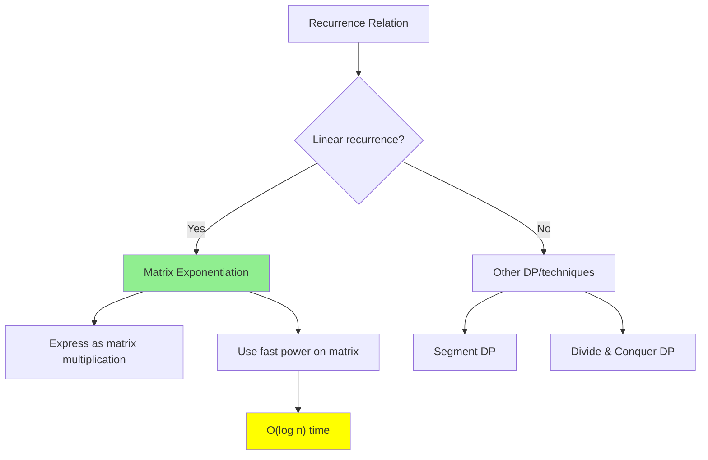

# Matrix Exponentiation

> **Compute the n-th term of linear recurrences in O(log n) time.**
>
> The key technique for Fibonacci, path counting, and sequence problems.

---

## 🎯 Pattern Recognition



**Use matrix exponentiation when:**
- Linear recurrence: f(n) = a₁f(n-1) + a₂f(n-2) + ... + aₖf(n-k)
- n is very large (10⁹ or more)
- Need O(log n) instead of O(n)
- Counting paths in a graph with exactly k steps

---

## 📐 The Core Idea

**Any linear recurrence can be expressed as matrix multiplication.**

### Fibonacci Example

$$F_n = F_{n-1} + F_{n-2}$$

We can write:

$$\begin{bmatrix} F_{n} \\ F_{n-1} \end{bmatrix} = \begin{bmatrix} 1 & 1 \\ 1 & 0 \end{bmatrix} \times \begin{bmatrix} F_{n-1} \\ F_{n-2} \end{bmatrix}$$

Therefore:

$$\begin{bmatrix} F_{n} \\ F_{n-1} \end{bmatrix} = \begin{bmatrix} 1 & 1 \\ 1 & 0 \end{bmatrix}^{n-1} \times \begin{bmatrix} F_1 \\ F_0 \end{bmatrix}$$

**Key insight:** We can compute matrix^n in O(log n) using fast power!

---

## 💻 Matrix Multiplication

```python
def matrix_mult(A: list[list[int]], B: list[list[int]], 
                mod: int = None) -> list[list[int]]:
    """
    Multiply two square matrices A × B.
    
    Time: O(n³) for n×n matrices
    """
    n = len(A)
    result = [[0] * n for _ in range(n)]
    
    for i in range(n):
        for j in range(n):
            for k in range(n):
                result[i][j] += A[i][k] * B[k][j]
                if mod:
                    result[i][j] %= mod
    
    return result


def identity_matrix(n: int) -> list[list[int]]:
    """Return n×n identity matrix."""
    return [[1 if i == j else 0 for j in range(n)] for i in range(n)]
```

```javascript
function matrixMult(A, B, mod = null) {
    const n = A.length;
    const result = Array(n).fill(null).map(() => Array(n).fill(0));
    
    for (let i = 0; i < n; i++) {
        for (let j = 0; j < n; j++) {
            for (let k = 0; k < n; k++) {
                result[i][j] += A[i][k] * B[k][j];
                if (mod) result[i][j] %= mod;
            }
        }
    }
    
    return result;
}
```

---

## 💻 Matrix Fast Power

```python
def matrix_power(M: list[list[int]], n: int, 
                 mod: int = None) -> list[list[int]]:
    """
    Compute M^n using binary exponentiation.
    
    Time: O(k³ log n) where k is matrix dimension
    Space: O(k²)
    """
    size = len(M)
    result = identity_matrix(size)
    
    while n > 0:
        if n & 1:
            result = matrix_mult(result, M, mod)
        M = matrix_mult(M, M, mod)
        n >>= 1
    
    return result


# Test with Fibonacci matrix
fib_matrix = [[1, 1], [1, 0]]
print(matrix_power(fib_matrix, 10))
# [[89, 55], [55, 34]] → F(11)=89, F(10)=55
```

```javascript
function matrixPower(M, n, mod = null) {
    const size = M.length;
    let result = identityMatrix(size);
    
    while (n > 0) {
        if (n & 1) result = matrixMult(result, M, mod);
        M = matrixMult(M, M, mod);
        n >>= 1;
    }
    
    return result;
}

function identityMatrix(n) {
    return Array(n).fill(null).map((_, i) => 
        Array(n).fill(0).map((_, j) => i === j ? 1 : 0)
    );
}
```

---

## 💻 Fibonacci in O(log n)

```python
def fibonacci(n: int, mod: int = 10**9 + 7) -> int:
    """
    Compute F(n) in O(log n) time.
    
    F(0) = 0, F(1) = 1, F(n) = F(n-1) + F(n-2)
    """
    if n == 0:
        return 0
    if n == 1:
        return 1
    
    # [F(n), F(n-1)] = M^(n-1) × [F(1), F(0)]
    M = [[1, 1], [1, 0]]
    result = matrix_power(M, n - 1, mod)
    
    # result[0][0] = F(n), result[0][1] = F(n-1)
    return result[0][0]


# Test
print(fibonacci(10))   # 55
print(fibonacci(50))   # 12586269025
print(fibonacci(10**9))  # Fast! Returns mod 10^9+7
```

---

## 📊 General Linear Recurrence Formula

For any linear recurrence:
$$f(n) = c_1 \cdot f(n-1) + c_2 \cdot f(n-2) + \ldots + c_k \cdot f(n-k)$$

The transition matrix is:

$$M = \begin{bmatrix} c_1 & c_2 & c_3 & \cdots & c_k \\ 1 & 0 & 0 & \cdots & 0 \\ 0 & 1 & 0 & \cdots & 0 \\ \vdots & & \ddots & & \vdots \\ 0 & 0 & \cdots & 1 & 0 \end{bmatrix}$$

### Tribonacci Example

$$T(n) = T(n-1) + T(n-2) + T(n-3)$$

```python
def tribonacci(n: int) -> int:
    """
    LeetCode 1137: N-th Tribonacci Number
    
    T(0) = 0, T(1) = 1, T(2) = 1
    T(n) = T(n-1) + T(n-2) + T(n-3)
    """
    if n == 0:
        return 0
    if n <= 2:
        return 1
    
    # Transition matrix for Tribonacci
    M = [
        [1, 1, 1],
        [1, 0, 0],
        [0, 1, 0]
    ]
    
    result = matrix_power(M, n - 2)
    
    # [T(n), T(n-1), T(n-2)] = M^(n-2) × [T(2), T(1), T(0)]
    # T(2)=1, T(1)=1, T(0)=0
    return result[0][0] + result[0][1]  # 1*T(2) + 1*T(1) + 0*T(0)


print(tribonacci(25))  # 1389537
```

---

## 💻 Path Counting with Matrix

**Problem:** Count paths of exactly k steps in a graph.

If A is the adjacency matrix, then A^k[i][j] = number of paths of length k from i to j.

```python
def count_paths(adj_matrix: list[list[int]], k: int, 
                start: int, end: int, mod: int = 10**9 + 7) -> int:
    """
    Count paths of exactly k steps from start to end.
    
    Time: O(V³ log k)
    """
    result = matrix_power(adj_matrix, k, mod)
    return result[start][end]


# Example: 3-node graph
# 0 -- 1 -- 2, 0 -- 2
adj = [
    [0, 1, 1],  # 0 connects to 1, 2
    [1, 0, 1],  # 1 connects to 0, 2
    [1, 1, 0]   # 2 connects to 0, 1
]

print(count_paths(adj, 2, 0, 0))  # Paths from 0 to 0 in 2 steps: 0→1→0, 0→2→0 = 2
```

---

## 💻 LeetCode 509: Fibonacci Number

```python
class Solution:
    def fib(self, n: int) -> int:
        """
        LeetCode 509: Fibonacci Number
        
        Three approaches:
        1. Recursive: O(2^n) - Too slow
        2. DP: O(n) - Good for small n
        3. Matrix: O(log n) - Best for large n
        """
        if n <= 1:
            return n
        
        def mult(A, B):
            return [
                [A[0][0]*B[0][0] + A[0][1]*B[1][0], 
                 A[0][0]*B[0][1] + A[0][1]*B[1][1]],
                [A[1][0]*B[0][0] + A[1][1]*B[1][0], 
                 A[1][0]*B[0][1] + A[1][1]*B[1][1]]
            ]
        
        def power(M, n):
            result = [[1, 0], [0, 1]]
            while n:
                if n & 1:
                    result = mult(result, M)
                M = mult(M, M)
                n >>= 1
            return result
        
        M = [[1, 1], [1, 0]]
        return power(M, n - 1)[0][0]
```

---

## 📐 Building the Matrix

**Step-by-step process:**

1. **Identify the recurrence:** f(n) = ...f(n-1)... + ...f(n-2)...
2. **Determine the state vector:** What values do we need?
3. **Build the transition matrix:** How does each component update?

### Example: f(n) = 2f(n-1) + 3f(n-2)

State vector: [f(n), f(n-1)]

Transition:
- f(n) = 2·f(n-1) + 3·f(n-2)
- f(n-1) = 1·f(n-1) + 0·f(n-2)

Matrix:
```
[f(n)  ]   [2 3] [f(n-1)]
[f(n-1)] = [1 0] [f(n-2)]
```

---

## ⚠️ Common Mistakes

### 1. Wrong Matrix Size

```python
# ❌ WRONG - matrix should be k×k for k terms in recurrence
# f(n) = f(n-1) + f(n-2) + f(n-3) needs 3×3 matrix
M = [[1, 1], [1, 0]]  # Only 2×2!

# ✅ CORRECT
M = [[1, 1, 1], [1, 0, 0], [0, 1, 0]]  # 3×3 for tribonacci
```

### 2. Off-by-One Errors

```python
# ❌ WRONG - computing wrong power
result = matrix_power(M, n)  # Gives F(n+1), not F(n)

# ✅ CORRECT - careful with indexing
result = matrix_power(M, n - 1)  # For F(n)
```

### 3. Forgetting Modulo in Large Numbers

```python
# ❌ WRONG - overflow for large n
result[i][j] += A[i][k] * B[k][j]

# ✅ CORRECT - apply mod at each step
result[i][j] = (result[i][j] + A[i][k] * B[k][j]) % mod
```

### 4. Wrong Initial State

```python
# ❌ WRONG - initial state doesn't match
# For F: F(1)=1, F(0)=0, not F(1)=1, F(2)=1!

# ✅ CORRECT - verify initial values
initial = [F[k-1], F[k-2], ..., F[0]]  # Matches recurrence order
```

---

## ⚡ Complexity Analysis

| Operation | Time | Space |
|-----------|------|-------|
| Matrix multiplication (k×k) | O(k³) | O(k²) |
| Matrix power (n) | O(k³ log n) | O(k²) |
| Fibonacci F(n) | O(log n) | O(1) |
| General k-term recurrence | O(k³ log n) | O(k²) |

**When matrix exponentiation wins:**
- n > 10⁶ and simple DP would time out
- k (recurrence order) is small (< 100)

---

## ✅ When to Use

| Scenario | Matrix Exp? |
|----------|-------------|
| n > 10⁶, linear recurrence | ✅ Yes |
| Small n (< 10⁵), any recurrence | ❌ Use simple DP |
| Non-linear recurrence | ❌ Not applicable |
| Path counting in graph | ✅ Yes |

## ❌ When NOT to Use

| Scenario | Alternative |
|----------|-------------|
| n is small | Simple DP (easier to implement) |
| Non-linear relation | Other techniques |
| Large k (100+ terms) | k³ becomes expensive |

---

## 📝 Practice Problems

| Problem | Difficulty | Key Technique |
|---------|------------|---------------|
| [Fibonacci Number](https://leetcode.com/problems/fibonacci-number/) | 🟢 Easy | 2×2 matrix |
| [N-th Tribonacci](https://leetcode.com/problems/n-th-tribonacci-number/) | 🟢 Easy | 3×3 matrix |
| [Climbing Stairs](https://leetcode.com/problems/climbing-stairs/) | 🟢 Easy | Same as Fibonacci |
| [Count Vowels Permutation](https://leetcode.com/problems/count-vowels-permutation/) | 🔴 Hard | 5×5 transition |

---

## 🎤 Interview Context

<details>
<summary><strong>How to Communicate</strong></summary>

**Explaining the approach:**
> "Since this is a linear recurrence and n is very large, I'll use matrix exponentiation. I can express the recurrence as matrix multiplication and use binary exponentiation to compute M^n in O(log n) time."

**On time complexity:**
> "Matrix multiplication is O(k³) for k×k matrices. With log n multiplications, total is O(k³ log n). For Fibonacci (k=2), that's O(log n)."

**Company Frequency:**
| Company | Frequency | Notes |
|---------|-----------|-------|
| Google | ⭐⭐⭐ | Competitive programming style |
| Quant firms | ⭐⭐⭐⭐ | Math-heavy interviews |
| Meta | ⭐⭐ | Occasionally |

</details>

---

## ⏱️ Time Estimates

| Activity | Time |
|----------|------|
| Understand concept | 20 min |
| Implement matrix mult | 10 min |
| Implement fast power | 10 min |
| Solve Fibonacci | 15 min |
| Master topic | 2 hours |

---

## 🧠 Spaced Repetition

<details>
<summary><strong>Review Schedule</strong></summary>

- **Day 1:** Derive Fibonacci matrix by hand
- **Day 3:** Implement from scratch
- **Day 7:** Tribonacci matrix
- **Day 14:** Path counting problem
- **Day 30:** Count Vowels Permutation

</details>

---

> **💡 Key Insight:** Any linear recurrence f(n) = Σcᵢf(n-i) can be computed in O(k³ log n) by expressing it as matrix exponentiation. The transition matrix is k×k where k is the number of terms in the recurrence. This reduces exponential or linear time to logarithmic!

> **🔗 Related:** [Fast Power](../01-Fundamentals/1.3-Fast-Power.md) | [Dynamic Programming](../../11-Dynamic-Programming/11-Dynamic-Programming.md) | [Fibonacci](../../02-Recursion-Backtracking/01-Recursion/1.4-Basic-Problems/01-Factorial-Fibonacci.md)
