# Number Theoretic Functions

> **Key functions in number theory: Euler's Totient, Divisor functions, and Möbius.**
>
> Essential for cryptography, counting, and advanced competitive programming.

---

## 🎯 Pattern Recognition

```mermaid
flowchart TD
    A["Number Theory Function"] --> B{"Which function?"}
    
    B -->|"Count coprimes"| C["Euler's Totient φ(n)"]
    B -->|"Count divisors"| D["Divisor Count τ(n)"]
    B -->|"Sum divisors"| E["Divisor Sum σ(n)"]
    B -->|"Inclusion-Exclusion"| F["Möbius μ(n)"]
    
    C --> C1["φ(n) = n × Π(1 - 1/p)"]
    D --> D1["τ(n) = Π(eᵢ + 1)"]
    E --> E1["σ(n) = Π(p^(e+1)-1)/(p-1)"]
    
    style C fill:#90EE90
    style C1 fill:#FFFF00
```



**Use these functions for:**
- RSA cryptography (Euler's φ)
- Counting problems (divisor functions)
- Advanced number theory (Möbius inversion)

---

## 📐 Euler's Totient Function φ(n)

**Definition:** φ(n) = count of integers in [1, n] that are coprime to n.

### Formula

For $n = p_1^{e_1} \cdot p_2^{e_2} \cdots p_k^{e_k}$:

$$\varphi(n) = n \cdot \prod_{p|n} \left(1 - \frac{1}{p}\right) = n \cdot \frac{p_1-1}{p_1} \cdot \frac{p_2-1}{p_2} \cdots$$

### Examples

| n | φ(n) | Coprimes |
|---|------|----------|
| 1 | 1 | {1} |
| 6 | 2 | {1, 5} |
| 10 | 4 | {1, 3, 7, 9} |
| 12 | 4 | {1, 5, 7, 11} |
| p (prime) | p-1 | {1, 2, ..., p-1} |

---

## 💻 Computing φ(n)

### Method 1: Direct Factorization

```python
def euler_phi(n: int) -> int:
    """
    Compute Euler's totient φ(n).
    
    Time: O(√n)
    Space: O(1)
    """
    result = n
    p = 2
    
    while p * p <= n:
        if n % p == 0:
            # Remove factor p
            while n % p == 0:
                n //= p
            # Apply formula: result *= (1 - 1/p) = result - result/p
            result -= result // p
        p += 1
    
    # If n > 1, then it's a prime factor
    if n > 1:
        result -= result // n
    
    return result


# Test
print(euler_phi(1))    # 1
print(euler_phi(6))    # 2
print(euler_phi(10))   # 4
print(euler_phi(12))   # 4
print(euler_phi(36))   # 12
```

```javascript
function eulerPhi(n) {
    let result = n;
    let p = 2;
    
    while (p * p <= n) {
        if (n % p === 0) {
            while (n % p === 0) n = Math.floor(n / p);
            result -= Math.floor(result / p);
        }
        p++;
    }
    
    if (n > 1) result -= Math.floor(result / n);
    return result;
}
```

### Method 2: Sieve for Multiple Values

```python
def euler_phi_sieve(max_n: int) -> list[int]:
    """
    Compute φ(i) for all i from 0 to max_n.
    
    Time: O(n log log n)
    Space: O(n)
    """
    phi = list(range(max_n + 1))  # phi[i] = i initially
    
    for p in range(2, max_n + 1):
        if phi[p] == p:  # p is prime
            for multiple in range(p, max_n + 1, p):
                phi[multiple] -= phi[multiple] // p
    
    return phi


# Test
phi = euler_phi_sieve(20)
print(phi[1:])  # [1, 1, 2, 2, 4, 2, 6, 4, 6, 4, 10, 4, 12, 6, 8, 8, 16, 6, 18, 8]
```

---

## 📊 Properties of φ(n)

| Property | Formula | Example |
|----------|---------|---------|
| Multiplicative | φ(mn) = φ(m)φ(n) if gcd(m,n)=1 | φ(6) = φ(2)φ(3) = 1×2 = 2 |
| Prime | φ(p) = p - 1 | φ(7) = 6 |
| Prime power | φ(pᵏ) = pᵏ - pᵏ⁻¹ | φ(8) = 8 - 4 = 4 |
| Sum formula | Σ_{d\|n} φ(d) = n | φ(1)+φ(2)+φ(4) = 1+1+2 = 4 |

---

## 💻 Euler's Theorem (Connection to Modular Inverse)

**Theorem:** If gcd(a, n) = 1, then:
$$a^{\varphi(n)} \equiv 1 \pmod{n}$$

**Corollary (Modular Inverse):**
$$a^{-1} \equiv a^{\varphi(n)-1} \pmod{n}$$

```python
def mod_inverse_euler(a: int, n: int) -> int:
    """
    Compute a^(-1) mod n using Euler's theorem.
    
    Works for any n (not just prime), as long as gcd(a, n) = 1.
    """
    from math import gcd
    if gcd(a, n) != 1:
        return -1
    
    phi_n = euler_phi(n)
    return pow(a, phi_n - 1, n)


# Test: 3^(-1) mod 10 (since gcd(3,10)=1)
print(mod_inverse_euler(3, 10))  # 7 (because 3×7=21≡1 mod 10)
```

---

## 📐 Divisor Functions

### τ(n) - Count of Divisors

$$\tau(n) = \sum_{d|n} 1 = \prod_{i}(e_i + 1)$$

For $n = p_1^{e_1} \cdot p_2^{e_2} \cdots$

```python
def divisor_count(n: int) -> int:
    """
    Count number of divisors of n.
    
    Time: O(√n)
    """
    count = 1
    p = 2
    
    while p * p <= n:
        if n % p == 0:
            exponent = 0
            while n % p == 0:
                n //= p
                exponent += 1
            count *= (exponent + 1)
        p += 1
    
    if n > 1:  # Remaining prime factor
        count *= 2
    
    return count


# Test
print(divisor_count(12))   # 6: divisors are 1,2,3,4,6,12
print(divisor_count(36))   # 9: 36 = 2²×3², count = 3×3 = 9
```

### σ(n) - Sum of Divisors

$$\sigma(n) = \sum_{d|n} d = \prod_{i}\frac{p_i^{e_i+1} - 1}{p_i - 1}$$

```python
def divisor_sum(n: int) -> int:
    """
    Sum of all divisors of n.
    
    Time: O(√n)
    """
    result = 1
    p = 2
    
    while p * p <= n:
        if n % p == 0:
            power_sum = 1
            power = 1
            while n % p == 0:
                n //= p
                power *= p
                power_sum += power
            result *= power_sum
        p += 1
    
    if n > 1:
        result *= (1 + n)
    
    return result


# Test
print(divisor_sum(12))   # 1+2+3+4+6+12 = 28
print(divisor_sum(6))    # 1+2+3+6 = 12
```

---

## 💻 Perfect Numbers (Connection to σ)

A number n is **perfect** if σ(n) = 2n.

```python
def is_perfect(n: int) -> bool:
    """
    Check if n is a perfect number.
    
    LeetCode 507: Perfect Number
    """
    if n <= 1:
        return False
    return divisor_sum(n) == 2 * n


# First 4 perfect numbers
for n in range(1, 10000):
    if is_perfect(n):
        print(n, end=' ')  # 6 28 496 8128
```

---

## 📐 Möbius Function μ(n)

**Definition:**
- μ(1) = 1
- μ(n) = 0 if n has a squared prime factor
- μ(n) = (-1)^k if n is product of k distinct primes

```python
def mobius(n: int) -> int:
    """
    Compute Möbius function μ(n).
    
    Returns:
        1 if n = 1
        0 if n has squared prime factor
        (-1)^k if n is product of k distinct primes
    """
    if n == 1:
        return 1
    
    prime_count = 0
    p = 2
    
    while p * p <= n:
        if n % p == 0:
            n //= p
            prime_count += 1
            if n % p == 0:  # Squared factor!
                return 0
        p += 1
    
    if n > 1:  # One more prime factor
        prime_count += 1
    
    return 1 if prime_count % 2 == 0 else -1


# Test
print([mobius(i) for i in range(1, 13)])
# [1, -1, -1, 0, -1, 1, -1, 0, 0, 1, -1, 0]
```

### Möbius Sieve

```python
def mobius_sieve(max_n: int) -> list[int]:
    """
    Compute μ(i) for all i from 0 to max_n.
    """
    mu = [1] * (max_n + 1)
    is_prime = [True] * (max_n + 1)
    
    for p in range(2, max_n + 1):
        if is_prime[p]:
            for multiple in range(p, max_n + 1, p):
                is_prime[multiple] = (multiple == p)
                mu[multiple] *= -1
            
            p_sq = p * p
            for multiple in range(p_sq, max_n + 1, p_sq):
                mu[multiple] = 0
    
    return mu
```

---

## 📊 Summary Table

| Function | Definition | Formula | Multiplicative? |
|----------|------------|---------|-----------------|
| φ(n) | Count coprimes to n | n × Π(1 - 1/p) | ✅ Yes |
| τ(n) | Count divisors | Π(eᵢ + 1) | ✅ Yes |
| σ(n) | Sum of divisors | Π(pᵉ⁺¹-1)/(p-1) | ✅ Yes |
| μ(n) | Inclusion-exclusion | (-1)ᵏ or 0 | ✅ Yes |

---
## ⚡ Complexity Analysis

| Function | Single Value | Sieve (1 to n) | Notes |
|----------|--------------|----------------|-------|
| φ(n) | O(√n) | O(n log log n) | Factorization vs linear sieve |
| τ(n) | O(√n) | O(n log n) | Count divisors via factorization |
| σ(n) | O(√n) | O(n log n) | Sum divisors via factorization |
| μ(n) | O(√n) | O(n log log n) | Check for squared factors |

**Why O(√n) for single value:**
- All functions require prime factorization
- Trial division up to √n suffices

**Why sieve is faster for range:**
- Precompute smallest prime factor for all numbers
- Process each number in O(log n) using SPF

---
## ⚠️ Common Mistakes

### 1. Forgetting φ(1) = 1

```python
# ❌ WRONG
def phi(n):
    if n == 1:
        return 0  # Wrong!
    ...

# ✅ CORRECT
def phi(n):
    if n == 1:
        return 1  # The only number coprime to 1 is 1 itself
```

### 2. Wrong Divisor Count for 1

```python
# ❌ WRONG - missing 1 as a divisor
# 1 has exactly 1 divisor: itself

# ✅ CORRECT
divisor_count(1)  # Returns 1
```

### 3. Squared Factor in Möbius

```python
# ❌ WRONG - not checking for squared factors
if n % p == 0:
    n //= p
    count += 1

# ✅ CORRECT - check if p² divides n
if n % p == 0:
    n //= p
    if n % p == 0:  # p² divides original n
        return 0
```

---

## ✅ When to Use

| Function | Use Case |
|----------|----------|
| φ(n) | RSA, modular inverse, counting coprimes |
| τ(n) | Perfect squares, highly composite numbers |
| σ(n) | Perfect numbers, amicable numbers |
| μ(n) | Inclusion-exclusion, Möbius inversion |

## ❌ When NOT to Use

| Scenario | Alternative |
|----------|-------------|
| Need all coprimes explicitly | Just iterate and check GCD |
| Single query, small n | Direct factorization |

---

## 📝 Practice Problems

| Problem | Difficulty | Key Technique |
|---------|------------|---------------|
| [Perfect Number](https://leetcode.com/problems/perfect-number/) | 🟢 Easy | Divisor sum |
| [Ugly Number II](https://leetcode.com/problems/ugly-number-ii/) | 🟡 Medium | Prime factors |
| [Count Primes](https://leetcode.com/problems/count-primes/) | 🟡 Medium | Sieve (related) |

---

## 🎤 Interview Context

<details>
<summary><strong>How to Communicate</strong></summary>

**On Euler's totient:**
> "Euler's totient φ(n) counts integers from 1 to n that are coprime to n. For prime p, φ(p) = p-1. The formula uses the prime factorization."

**On divisor functions:**
> "To count divisors, I factorize n = p₁^e₁ × p₂^e₂ × ... and use the formula τ(n) = (e₁+1)(e₂+1)..."

**Company Frequency:**
| Company | Frequency | Notes |
|---------|-----------|-------|
| Quant firms | ⭐⭐⭐⭐⭐ | Heavy number theory |
| Google | ⭐⭐ | Occasional |
| Competitive | ⭐⭐⭐⭐⭐ | Very common |

</details>

---

## ⏱️ Time Estimates

| Activity | Time |
|----------|------|
| Understand φ(n) | 20 min |
| Implement φ(n) | 15 min |
| Divisor functions | 15 min |
| Möbius function | 20 min |
| Master topic | 2 hours |

---

## 🧠 Spaced Repetition

<details>
<summary><strong>Review Schedule</strong></summary>

- **Day 1:** Compute φ(12), φ(36) by hand
- **Day 3:** Implement euler_phi()
- **Day 7:** Divisor count and sum
- **Day 14:** Phi sieve for range
- **Day 30:** Möbius function

</details>

---

> **💡 Key Insight:** All these functions are **multiplicative**: f(mn) = f(m)f(n) when gcd(m,n) = 1. This means we only need to know how they behave on prime powers, and we can combine using prime factorization. φ(n) is especially important as it connects to Euler's theorem and modular inverses.

> **🔗 Related:** [Modular Inverse](../05-Modular-Inverse/5.1-Modular-Inverse-Basics.md) | [Sieve of Eratosthenes](../03-Prime-Numbers/3.2-Sieve-of-Eratosthenes.md) | [Prime Factorization](../03-Prime-Numbers/3.1-Prime-Basics.md)
