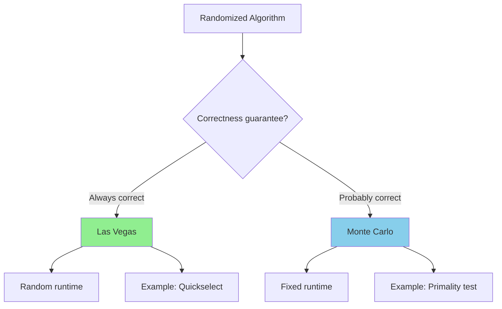

# Randomized Algorithms

> **Using randomness to achieve efficiency or simplicity.**
>
> Monte Carlo and Las Vegas algorithms for probabilistic problem-solving.

---

## 🎯 Pattern Recognition



**Two types:**
- **Las Vegas:** Always correct, random running time (e.g., randomized QuickSort)
- **Monte Carlo:** May be incorrect, fixed running time (e.g., Miller-Rabin)

---

## 📐 Why Randomization?

| Benefit | Example |
|---------|---------|
| Avoid worst case | Randomized pivot in QuickSort |
| Simplify algorithm | Randomized selection |
| Defeat adversarial input | Hash function with random seed |
| Probabilistic correctness | Primality testing |

---

## 💻 Randomized QuickSelect

Find k-th smallest element in expected O(n) time.

```python
import random

def quickselect(arr: list[int], k: int) -> int:
    """
    Find k-th smallest element (1-indexed).
    
    Las Vegas algorithm:
    - Always correct
    - Expected O(n), worst O(n²)
    
    Time: O(n) expected
    Space: O(1)
    """
    arr = arr.copy()  # Don't modify original
    left, right = 0, len(arr) - 1
    k -= 1  # Convert to 0-indexed
    
    while left <= right:
        # Random pivot to avoid worst case
        pivot_idx = random.randint(left, right)
        pivot_idx = partition(arr, left, right, pivot_idx)
        
        if pivot_idx == k:
            return arr[pivot_idx]
        elif pivot_idx < k:
            left = pivot_idx + 1
        else:
            right = pivot_idx - 1
    
    return -1


def partition(arr: list[int], left: int, right: int, 
              pivot_idx: int) -> int:
    """Partition array around pivot, return final pivot position."""
    pivot = arr[pivot_idx]
    arr[pivot_idx], arr[right] = arr[right], arr[pivot_idx]
    
    store_idx = left
    for i in range(left, right):
        if arr[i] < pivot:
            arr[i], arr[store_idx] = arr[store_idx], arr[i]
            store_idx += 1
    
    arr[store_idx], arr[right] = arr[right], arr[store_idx]
    return store_idx


# Test
arr = [3, 2, 1, 5, 4, 6]
print(quickselect(arr, 3))  # 3 (3rd smallest)
print(quickselect(arr, 1))  # 1 (minimum)
```

```javascript
function quickselect(arr, k) {
    arr = [...arr];
    let left = 0, right = arr.length - 1;
    k--;
    
    while (left <= right) {
        const pivotIdx = Math.floor(Math.random() * (right - left + 1)) + left;
        const pos = partition(arr, left, right, pivotIdx);
        
        if (pos === k) return arr[pos];
        if (pos < k) left = pos + 1;
        else right = pos - 1;
    }
    
    return -1;
}

function partition(arr, left, right, pivotIdx) {
    const pivot = arr[pivotIdx];
    [arr[pivotIdx], arr[right]] = [arr[right], arr[pivotIdx]];
    
    let storeIdx = left;
    for (let i = left; i < right; i++) {
        if (arr[i] < pivot) {
            [arr[i], arr[storeIdx]] = [arr[storeIdx], arr[i]];
            storeIdx++;
        }
    }
    
    [arr[storeIdx], arr[right]] = [arr[right], arr[storeIdx]];
    return storeIdx;
}
```

---

## 💻 Miller-Rabin Primality Test

Probabilistic primality test with adjustable accuracy.

```python
import random

def is_prime_miller_rabin(n: int, k: int = 10) -> bool:
    """
    Miller-Rabin primality test.
    
    Monte Carlo algorithm:
    - If returns False: n is definitely composite
    - If returns True: n is probably prime
    - Error probability: < (1/4)^k
    
    Time: O(k × log³ n)
    """
    if n < 2:
        return False
    if n == 2 or n == 3:
        return True
    if n % 2 == 0:
        return False
    
    # Write n-1 = 2^r × d where d is odd
    r, d = 0, n - 1
    while d % 2 == 0:
        r += 1
        d //= 2
    
    # Witness loop
    def check_witness(a):
        x = pow(a, d, n)
        
        if x == 1 or x == n - 1:
            return True
        
        for _ in range(r - 1):
            x = pow(x, 2, n)
            if x == n - 1:
                return True
        
        return False
    
    # Test k random witnesses
    for _ in range(k):
        a = random.randrange(2, n - 1)
        if not check_witness(a):
            return False  # Definitely composite
    
    return True  # Probably prime


# Test
print(is_prime_miller_rabin(17))        # True
print(is_prime_miller_rabin(561))       # False (Carmichael number)
print(is_prime_miller_rabin(10**9 + 7)) # True (common MOD)
```

```javascript
function isPrimeMillerRabin(n, k = 10) {
    if (n < 2) return false;
    if (n === 2 || n === 3) return true;
    if (n % 2 === 0) return false;
    
    // n - 1 = 2^r × d
    let r = 0, d = n - 1;
    while (d % 2 === 0) {
        r++;
        d = Math.floor(d / 2);
    }
    
    function modPow(base, exp, mod) {
        let result = 1;
        base = base % mod;
        while (exp > 0) {
            if (exp % 2 === 1) result = (result * base) % mod;
            exp = Math.floor(exp / 2);
            base = (base * base) % mod;
        }
        return result;
    }
    
    function checkWitness(a) {
        let x = modPow(a, d, n);
        if (x === 1 || x === n - 1) return true;
        
        for (let i = 0; i < r - 1; i++) {
            x = modPow(x, 2, n);
            if (x === n - 1) return true;
        }
        return false;
    }
    
    for (let i = 0; i < k; i++) {
        const a = Math.floor(Math.random() * (n - 3)) + 2;
        if (!checkWitness(a)) return false;
    }
    
    return true;
}
```

---

## 💻 Reservoir Sampling

Select k items uniformly at random from a stream of unknown size.

```python
import random

def reservoir_sample(stream, k: int) -> list:
    """
    Select k items uniformly at random from a stream.
    
    Each item has probability k/n of being in final sample.
    
    Time: O(n)
    Space: O(k)
    """
    reservoir = []
    
    for i, item in enumerate(stream):
        if i < k:
            reservoir.append(item)
        else:
            # Replace element at random index with probability k/(i+1)
            j = random.randint(0, i)
            if j < k:
                reservoir[j] = item
    
    return reservoir


# LeetCode 382: Linked List Random Node
class ListNode:
    def __init__(self, val=0, next=None):
        self.val = val
        self.next = next

class Solution:
    def __init__(self, head: ListNode):
        self.head = head
    
    def getRandom(self) -> int:
        """Get random node with equal probability."""
        result = self.head.val
        node = self.head.next
        i = 1
        
        while node:
            i += 1
            if random.randint(1, i) == 1:  # Probability 1/i
                result = node.val
            node = node.next
        
        return result
```

```javascript
function reservoirSample(stream, k) {
    const reservoir = [];
    let i = 0;
    
    for (const item of stream) {
        if (i < k) {
            reservoir.push(item);
        } else {
            const j = Math.floor(Math.random() * (i + 1));
            if (j < k) reservoir[j] = item;
        }
        i++;
    }
    
    return reservoir;
}
```

---

## 💻 Random Shuffle (Fisher-Yates)

```python
import random

def shuffle(arr: list) -> list:
    """
    LeetCode 384: Shuffle an Array
    
    Fisher-Yates shuffle - each permutation equally likely.
    
    Time: O(n)
    Space: O(1) in-place
    """
    arr = arr.copy()
    n = len(arr)
    
    for i in range(n - 1, 0, -1):
        j = random.randint(0, i)
        arr[i], arr[j] = arr[j], arr[i]
    
    return arr


# Verify uniformity
from collections import Counter
results = Counter()
for _ in range(10000):
    results[tuple(shuffle([1, 2, 3]))] += 1
print(results)  # Each permutation ~1666 times
```

---

## 💻 Randomized Skip List

Probabilistic data structure for O(log n) operations.

```python
import random

class SkipListNode:
    def __init__(self, val: int, level: int):
        self.val = val
        self.forward = [None] * (level + 1)

class SkipList:
    """
    LeetCode 1206: Design Skiplist
    
    Probabilistic alternative to balanced BST.
    Expected O(log n) search, insert, delete.
    """
    MAX_LEVEL = 16
    P = 0.5  # Probability of level increase
    
    def __init__(self):
        self.head = SkipListNode(-1, self.MAX_LEVEL)
        self.level = 0
    
    def random_level(self) -> int:
        lvl = 0
        while random.random() < self.P and lvl < self.MAX_LEVEL:
            lvl += 1
        return lvl
    
    def search(self, target: int) -> bool:
        current = self.head
        for i in range(self.level, -1, -1):
            while current.forward[i] and current.forward[i].val < target:
                current = current.forward[i]
        current = current.forward[0]
        return current is not None and current.val == target
    
    def add(self, num: int) -> None:
        update = [None] * (self.MAX_LEVEL + 1)
        current = self.head
        
        for i in range(self.level, -1, -1):
            while current.forward[i] and current.forward[i].val < num:
                current = current.forward[i]
            update[i] = current
        
        lvl = self.random_level()
        if lvl > self.level:
            for i in range(self.level + 1, lvl + 1):
                update[i] = self.head
            self.level = lvl
        
        new_node = SkipListNode(num, lvl)
        for i in range(lvl + 1):
            new_node.forward[i] = update[i].forward[i]
            update[i].forward[i] = new_node
```

---

## 📊 Algorithm Comparison

| Algorithm | Type | Guarantee | Time |
|-----------|------|-----------|------|
| Quickselect | Las Vegas | Always correct | O(n) expected |
| Miller-Rabin | Monte Carlo | Probably correct | O(k log³ n) |
| Reservoir Sampling | Las Vegas | Always correct | O(n) |
| Fisher-Yates | Las Vegas | Always correct | O(n) |
| Skip List | Las Vegas | Always correct | O(log n) expected |

---

## ⚠️ Common Mistakes

### 1. Wrong Random Range

```python
# ❌ WRONG - doesn't include right endpoint
j = random.randint(left, right - 1)

# ✅ CORRECT - randint is inclusive on both ends
j = random.randint(left, right)
```

### 2. Biased Shuffle

```python
# ❌ WRONG - biased distribution!
for i in range(n):
    j = random.randint(0, n - 1)  # Wrong!
    arr[i], arr[j] = arr[j], arr[i]

# ✅ CORRECT - Fisher-Yates
for i in range(n - 1, 0, -1):
    j = random.randint(0, i)  # Only swap with earlier elements
    arr[i], arr[j] = arr[j], arr[i]
```

### 3. Not Enough Iterations

```python
# ❌ WRONG - too few witnesses
is_prime_miller_rabin(n, k=1)  # 25% error rate!

# ✅ CORRECT - enough iterations
is_prime_miller_rabin(n, k=10)  # < 0.0001% error
```

### 4. Using Deterministic Seed in Competition

```python
# ❌ DANGEROUS - predictable in adversarial setting
random.seed(42)

# ✅ BETTER - truly random seed
random.seed()  # Uses system time/entropy
```

---

## ⚡ Complexity Analysis

| Algorithm | Expected | Worst | Space |
|-----------|----------|-------|-------|
| Quickselect | O(n) | O(n²) | O(1) |
| Miller-Rabin (k iters) | O(k log³ n) | O(k log³ n) | O(1) |
| Reservoir (k items) | O(n) | O(n) | O(k) |
| Fisher-Yates | O(n) | O(n) | O(1) |

---

## ✅ When to Use

| Scenario | Randomized Algorithm |
|----------|----------------------|
| K-th element | Quickselect |
| Large number primality | Miller-Rabin |
| Stream sampling | Reservoir Sampling |
| Card shuffling | Fisher-Yates |
| Fast dictionary | Skip List |

## ❌ When NOT to Use

| Scenario | Alternative |
|----------|-------------|
| Need deterministic output | Deterministic algorithms |
| Cryptographic security | Cryptographically secure RNG |
| Small inputs | Simpler algorithms |

---

## 📝 Practice Problems

| Problem | Difficulty | Key Technique |
|---------|------------|---------------|
| [Shuffle an Array](https://leetcode.com/problems/shuffle-an-array/) | 🟡 Medium | Fisher-Yates |
| [Linked List Random Node](https://leetcode.com/problems/linked-list-random-node/) | 🟡 Medium | Reservoir sampling |
| [Random Pick Index](https://leetcode.com/problems/random-pick-index/) | 🟡 Medium | Reservoir sampling |
| [Design Skiplist](https://leetcode.com/problems/design-skiplist/) | 🔴 Hard | Probabilistic levels |
| [Kth Largest Element](https://leetcode.com/problems/kth-largest-element-in-an-array/) | 🟡 Medium | Quickselect |

---

## 🎤 Interview Context

<details>
<summary><strong>How to Communicate</strong></summary>

**On randomization benefit:**
> "By choosing a random pivot, we avoid the worst case of always picking the smallest or largest element. This gives us expected O(n) time instead of guaranteed O(n²)."

**On Monte Carlo vs Las Vegas:**
> "Miller-Rabin is Monte Carlo - it might say 'prime' for a composite, but the probability is very low. Quickselect is Las Vegas - it's always correct, just the runtime varies."

**Company Frequency:**
| Company | Frequency | Notes |
|---------|-----------|-------|
| Meta | ⭐⭐⭐ | Reservoir sampling |
| Amazon | ⭐⭐ | Shuffle problems |
| Quant | ⭐⭐⭐⭐ | Probability questions |

</details>

---

## ⏱️ Time Estimates

| Activity | Time |
|----------|------|
| Quickselect | 20 min |
| Fisher-Yates | 10 min |
| Reservoir sampling | 20 min |
| Miller-Rabin | 30 min |
| Master topic | 2 hours |

---

## 🧠 Spaced Repetition

<details>
<summary><strong>Review Schedule</strong></summary>

- **Day 1:** Implement Fisher-Yates
- **Day 3:** Reservoir sampling
- **Day 7:** Quickselect
- **Day 14:** Miller-Rabin
- **Day 30:** Skip List basics

</details>

---

> **💡 Key Insight:** Randomization defeats adversarial inputs. The expected-case analysis assumes random choices, which we control. For Quickselect, random pivot gives O(n) expected even though worst case is O(n²). For Monte Carlo algorithms, we trade a small probability of error for faster/simpler algorithms.

> **🔗 Related:** [Quick Sort](../../03-Sorting-Searching/03-Sorting-Searching.md) | [Probability](./7.2-Number-Theoretic-Functions.md) | [Linked Lists](../../04-Linked-Lists/04-Linked-Lists.md)
