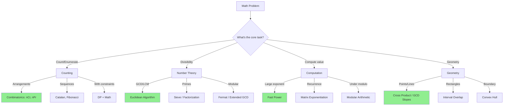

# Pattern Recognition in Math Problems

> **How to identify the right mathematical technique for interview problems.**
>
> Quick decision framework for common math problem types.

---

## 🎯 Master Decision Tree



---

## 📊 Quick Pattern Reference

### By Problem Statement Keywords

| Keyword | Likely Technique | Example |
|---------|------------------|---------|
| "divisible by" | GCD/LCM, Modular | GCD Greatest String Divisor |
| "prime" | Sieve, Factorization | Count Primes |
| "factorial" | Trailing zeros, Modular | Factorial Trailing Zeroes |
| "combinations", "ways" | nCr, Catalan, DP | Unique Paths |
| "power", "exponent" | Fast Power | Pow(x, n) |
| "points on a line" | GCD for slopes | Max Points on a Line |
| "rectangle overlap" | Interval math | Rectangle Overlap |
| "mod 10^9+7" | Modular arithmetic | Almost always needed |

---

## 🔢 Pattern 1: Divisibility Problems

**Signals:**
- "Greatest common divisor"
- "Least common multiple"
- "Divisible by X and Y"
- "Common divisor strings"

**Technique:** Euclidean Algorithm

```python
# Template
from math import gcd, lcm

# GCD of two numbers
g = gcd(a, b)

# LCM = (a * b) / gcd(a, b)
l = lcm(a, b)

# GCD of list
from functools import reduce
g = reduce(gcd, arr)
```

**Example Problems:**
- [Greatest Common Divisor of Strings](https://leetcode.com/problems/greatest-common-divisor-of-strings/)
- [X of a Kind in a Deck of Cards](https://leetcode.com/problems/x-of-a-kind-in-a-deck-of-cards/)

---

## 🔢 Pattern 2: Prime Number Problems

**Signals:**
- "Prime numbers"
- "Count primes less than n"
- "Prime factorization"
- "Perfect number" (sum of divisors)

**Technique:** Sieve of Eratosthenes or Trial Division

```python
# Template: Sieve
def sieve(n):
    is_prime = [True] * (n + 1)
    is_prime[0] = is_prime[1] = False
    for i in range(2, int(n**0.5) + 1):
        if is_prime[i]:
            for j in range(i*i, n + 1, i):
                is_prime[j] = False
    return is_prime

# Template: Factorization
def factorize(n):
    factors = []
    d = 2
    while d * d <= n:
        while n % d == 0:
            factors.append(d)
            n //= d
        d += 1
    if n > 1:
        factors.append(n)
    return factors
```

**Example Problems:**
- [Count Primes](https://leetcode.com/problems/count-primes/)
- [Ugly Number](https://leetcode.com/problems/ugly-number/)
- [Perfect Number](https://leetcode.com/problems/perfect-number/)

---

## 🔢 Pattern 3: Modular Arithmetic

**Signals:**
- "Return answer mod 10^9+7"
- "Large numbers"
- Need to compute nCr for large n

**Technique:** Modular operations + Fermat's Little Theorem

```python
MOD = 10**9 + 7

# Template: Modular operations
result = (a + b) % MOD
result = (a * b) % MOD
result = (a - b + MOD) % MOD  # Handle negative

# Template: Modular inverse (for division)
def mod_inverse(a, mod=MOD):
    return pow(a, mod - 2, mod)

# Template: nCr with mod
def nCr(n, r, mod=MOD):
    if r > n or r < 0:
        return 0
    num = den = 1
    for i in range(r):
        num = (num * (n - i)) % mod
        den = (den * (i + 1)) % mod
    return (num * mod_inverse(den, mod)) % mod
```

**Example Problems:**
- [Unique Paths](https://leetcode.com/problems/unique-paths/)
- [Count Good Numbers](https://leetcode.com/problems/count-good-numbers/)

---

## 🔢 Pattern 4: Power/Exponentiation

**Signals:**
- "x raised to power n"
- "Very large exponent"
- "Compute efficiently"

**Technique:** Binary Exponentiation (Fast Power)

```python
# Template: Fast Power
def fast_pow(base, exp, mod=None):
    result = 1
    while exp > 0:
        if exp & 1:
            result = result * base
            if mod:
                result %= mod
        base = base * base
        if mod:
            base %= mod
        exp >>= 1
    return result

# Or simply use Python's built-in
pow(base, exp, mod)
```

**Example Problems:**
- [Pow(x, n)](https://leetcode.com/problems/powx-n/)
- [Super Pow](https://leetcode.com/problems/super-pow/)

---

## 🔢 Pattern 5: Counting & Combinatorics

**Signals:**
- "Number of ways"
- "Count combinations"
- "How many paths"
- "Unique arrangements"

**Technique:** nCr, Catalan, Stars and Bars, DP

```python
# Template: Basic counting
# Arrangements: n! / (n-r)!
# Combinations: n! / (r! × (n-r)!)

# Catalan for parentheses, BST counting
def catalan(n):
    if n <= 1:
        return 1
    dp = [0] * (n + 1)
    dp[0] = dp[1] = 1
    for i in range(2, n + 1):
        for j in range(i):
            dp[i] += dp[j] * dp[i-1-j]
    return dp[n]

# Stars and Bars: distribute n items into k bins
# Non-negative: C(n + k - 1, k - 1)
# Positive: C(n - 1, k - 1)
```

**Example Problems:**
- [Unique Binary Search Trees](https://leetcode.com/problems/unique-binary-search-trees/)
- [Generate Parentheses](https://leetcode.com/problems/generate-parentheses/)
- [Count Sorted Vowel Strings](https://leetcode.com/problems/count-sorted-vowel-strings/)

---

## 🔢 Pattern 6: Factorial & Digit Problems

**Signals:**
- "Trailing zeros in factorial"
- "Digit manipulation"
- "Reverse integer"
- "Palindrome number"

**Technique:** Legendre's formula, Modular arithmetic

```python
# Template: Trailing zeros in n!
def trailing_zeros(n):
    count = 0
    while n >= 5:
        n //= 5
        count += n
    return count

# Template: Digit extraction
def get_digits(n):
    digits = []
    while n:
        digits.append(n % 10)
        n //= 10
    return digits[::-1]

# Template: Reverse number
def reverse_num(n):
    result = 0
    while n:
        result = result * 10 + n % 10
        n //= 10
    return result
```

**Example Problems:**
- [Factorial Trailing Zeroes](https://leetcode.com/problems/factorial-trailing-zeroes/)
- [Reverse Integer](https://leetcode.com/problems/reverse-integer/)
- [Palindrome Number](https://leetcode.com/problems/palindrome-number/)

---

## 🔢 Pattern 7: Geometry

**Signals:**
- "Points on a plane"
- "Rectangle overlap"
- "Valid square"
- "Distance between points"

**Technique:** Cross product, GCD for slopes, Interval math

```python
# Template: Collinearity check
def collinear(a, b, c):
    return (b[0] - a[0]) * (c[1] - a[1]) == (c[0] - a[0]) * (b[1] - a[1])

# Template: GCD slope for line problems
def get_slope(p1, p2):
    dx, dy = p2[0] - p1[0], p2[1] - p1[1]
    if dx == 0:
        return (1, 0)
    if dy == 0:
        return (0, 1)
    if dx < 0:
        dx, dy = -dx, -dy
    g = gcd(abs(dx), abs(dy))
    return (dy // g, dx // g)

# Template: Rectangle overlap
def rect_overlap(r1, r2):
    return r1[0] < r2[2] and r2[0] < r1[2] and r1[1] < r2[3] and r2[1] < r1[3]
```

**Example Problems:**
- [Max Points on a Line](https://leetcode.com/problems/max-points-on-a-line/)
- [Rectangle Overlap](https://leetcode.com/problems/rectangle-overlap/)
- [Valid Square](https://leetcode.com/problems/valid-square/)

---

## 📋 Decision Matrix

| If You See... | First Try... | If That Fails... |
|---------------|--------------|------------------|
| "mod 10^9+7" | Modular arithmetic | Matrix exponentiation |
| "divisible by" | GCD/LCM | Prime factorization |
| "prime" | Sieve | Trial division |
| "count ways" | nCr | DP with combinatorics |
| "power of" | Fast power | Bit manipulation |
| "points, lines" | Cross product | GCD slopes |
| "rectangle" | Interval overlap | Sweep line |

---

## ⚠️ Common Traps

### 1. Overflow

```python
# ❌ Compute then mod
result = factorial(1000) % MOD  # factorial(1000) overflows first!

# ✅ Mod during computation
result = 1
for i in range(1, 1001):
    result = (result * i) % MOD
```

### 2. Negative Numbers

```python
# ❌ Power with negative exponent
pow(-2, 10)  # Correct in Python, but watch out!

# Handle negative base for Pow(x, n)
if n < 0:
    x = 1 / x
    n = -n
```

### 3. Edge Cases

```python
# Always check:
# n = 0, n = 1
# Empty input
# Single element
# Negative numbers
# Very large numbers
```

---

## ⏱️ Time Complexity Reference

| Algorithm | Time | When to Use |
|-----------|------|-------------|
| GCD | O(log min(a,b)) | Always efficient |
| Sieve | O(n log log n) | n ≤ 10^7 |
| Trial division | O(√n) | Single number |
| Fast power | O(log n) | Any exponent |
| nCr (direct) | O(r) | Small r |
| nCr (precompute) | O(n) prep, O(1) query | Many queries |
| Matrix exp | O(k³ log n) | Linear recurrence |

---

## 🎯 Interview Strategy


**Steps:**
1. **Read carefully:** Look for keywords in the problem
2. **Identify constraints:** n ≤ 10^9 suggests O(log n) solution
3. **Match pattern:** Use the decision tree above
4. **Apply template:** Start with standard implementation
5. **Edge cases:** n=0, n=1, negative, overflow
6. **Verify:** Check time/space against constraints

---

> **💡 Key Insight:** Most math problems in interviews use just 5-7 core techniques. Master the templates, recognize the patterns, and you can solve 90% of math problems quickly.

> **🔗 Related:** [Common Templates →](./8.2-Common-Templates.md) | [Practice Problems](./8.3-Practice-Problems.md)
