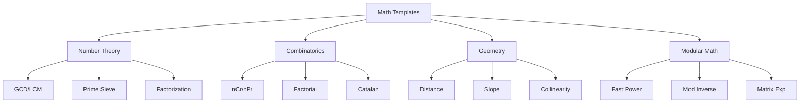

# Common Math Templates

> **Copy-paste ready implementations for interview problems.**
>
> Battle-tested code for the most common math patterns.

---

## 🎯 Template Overview



---

## 📐 Template 1: GCD and LCM

```python
# ==========================================
# GCD / LCM Template
# ==========================================

from math import gcd
from functools import reduce

def lcm(a: int, b: int) -> int:
    """Least Common Multiple"""
    return a * b // gcd(a, b)

def gcd_list(arr: list[int]) -> int:
    """GCD of entire array"""
    return reduce(gcd, arr)

def lcm_list(arr: list[int]) -> int:
    """LCM of entire array"""
    return reduce(lcm, arr)

def extended_gcd(a: int, b: int) -> tuple[int, int, int]:
    """Returns (gcd, x, y) where ax + by = gcd"""
    if b == 0:
        return a, 1, 0
    g, x, y = extended_gcd(b, a % b)
    return g, y, x - (a // b) * y


# JavaScript equivalent
"""
function gcd(a, b) {
    return b === 0 ? a : gcd(b, a % b);
}

function lcm(a, b) {
    return a * Math.floor(b / gcd(a, b));
}
"""
```

---

## 📐 Template 2: Prime Sieve

```python
# ==========================================
# Sieve of Eratosthenes Template
# ==========================================

def sieve(n: int) -> list[bool]:
    """
    Returns is_prime array where is_prime[i] = True if i is prime.
    Time: O(n log log n)
    """
    is_prime = [True] * (n + 1)
    is_prime[0] = is_prime[1] = False
    
    for i in range(2, int(n**0.5) + 1):
        if is_prime[i]:
            for j in range(i*i, n + 1, i):
                is_prime[j] = False
    
    return is_prime

def get_primes(n: int) -> list[int]:
    """Returns list of all primes up to n."""
    is_prime = sieve(n)
    return [i for i in range(2, n + 1) if is_prime[i]]

def smallest_prime_factor(n: int) -> list[int]:
    """SPF sieve for fast factorization."""
    spf = list(range(n + 1))
    for i in range(2, int(n**0.5) + 1):
        if spf[i] == i:  # i is prime
            for j in range(i*i, n + 1, i):
                if spf[j] == j:
                    spf[j] = i
    return spf


# JavaScript equivalent
"""
function sieve(n) {
    const isPrime = Array(n + 1).fill(true);
    isPrime[0] = isPrime[1] = false;
    
    for (let i = 2; i * i <= n; i++) {
        if (isPrime[i]) {
            for (let j = i * i; j <= n; j += i) {
                isPrime[j] = false;
            }
        }
    }
    return isPrime;
}
"""
```

---

## 📐 Template 3: Prime Factorization

```python
# ==========================================
# Prime Factorization Template
# ==========================================

from collections import Counter

def factorize(n: int) -> list[int]:
    """Returns list of prime factors (with repetition)."""
    factors = []
    d = 2
    while d * d <= n:
        while n % d == 0:
            factors.append(d)
            n //= d
        d += 1
    if n > 1:
        factors.append(n)
    return factors

def factorize_dict(n: int) -> dict[int, int]:
    """Returns {prime: exponent} dictionary."""
    return Counter(factorize(n))

def count_divisors(n: int) -> int:
    """Count number of divisors using prime factorization."""
    count = 1
    d = 2
    while d * d <= n:
        exp = 0
        while n % d == 0:
            n //= d
            exp += 1
        count *= (exp + 1)
        d += 1
    if n > 1:
        count *= 2
    return count


# JavaScript equivalent
"""
function factorize(n) {
    const factors = [];
    for (let d = 2; d * d <= n; d++) {
        while (n % d === 0) {
            factors.push(d);
            n = Math.floor(n / d);
        }
    }
    if (n > 1) factors.push(n);
    return factors;
}
"""
```

---

## 📐 Template 4: Fast Power

```python
# ==========================================
# Fast Power Template
# ==========================================

MOD = 10**9 + 7

def fast_pow(base: int, exp: int, mod: int = None) -> int:
    """
    Compute base^exp in O(log exp) time.
    """
    result = 1
    while exp > 0:
        if exp & 1:
            result = result * base
            if mod:
                result %= mod
        base = base * base
        if mod:
            base %= mod
        exp >>= 1
    return result

# Python built-in is also O(log n)
# pow(base, exp, mod)


# JavaScript equivalent (BigInt for large numbers)
"""
function fastPow(base, exp, mod = null) {
    let result = 1n;
    base = BigInt(base);
    exp = BigInt(exp);
    
    while (exp > 0n) {
        if (exp & 1n) {
            result = result * base;
            if (mod) result = result % BigInt(mod);
        }
        base = base * base;
        if (mod) base = base % BigInt(mod);
        exp >>= 1n;
    }
    return Number(result);
}
"""
```

---

## 📐 Template 5: Modular Inverse

```python
# ==========================================
# Modular Inverse Template
# ==========================================

MOD = 10**9 + 7

def mod_inverse(a: int, mod: int = MOD) -> int:
    """
    Compute a^(-1) mod m using Fermat's Little Theorem.
    REQUIRES: mod is prime!
    """
    return pow(a, mod - 2, mod)

def mod_inverse_extended(a: int, m: int) -> int:
    """
    Compute a^(-1) mod m using Extended GCD.
    Works for any m where gcd(a, m) = 1.
    """
    def ext_gcd(a, b):
        if b == 0:
            return a, 1, 0
        g, x, y = ext_gcd(b, a % b)
        return g, y, x - (a // b) * y
    
    g, x, _ = ext_gcd(a % m, m)
    if g != 1:
        return -1  # No inverse exists
    return (x % m + m) % m

def mod_divide(a: int, b: int, mod: int = MOD) -> int:
    """Compute (a / b) mod m = a * b^(-1) mod m"""
    return (a * mod_inverse(b, mod)) % mod
```

---

## 📐 Template 6: Combinatorics (nCr, nPr)

```python
# ==========================================
# Combinatorics Template
# ==========================================

MOD = 10**9 + 7

class Combinatorics:
    """Precompute factorials for O(1) nCr queries."""
    
    def __init__(self, max_n: int, mod: int = MOD):
        self.mod = mod
        self.fact = [1] * (max_n + 1)
        self.inv_fact = [1] * (max_n + 1)
        
        # Compute factorials
        for i in range(1, max_n + 1):
            self.fact[i] = self.fact[i-1] * i % mod
        
        # Compute inverse factorials
        self.inv_fact[max_n] = pow(self.fact[max_n], mod - 2, mod)
        for i in range(max_n - 1, -1, -1):
            self.inv_fact[i] = self.inv_fact[i+1] * (i+1) % mod
    
    def nCr(self, n: int, r: int) -> int:
        if r < 0 or r > n:
            return 0
        return self.fact[n] * self.inv_fact[r] % self.mod * self.inv_fact[n-r] % self.mod
    
    def nPr(self, n: int, r: int) -> int:
        if r < 0 or r > n:
            return 0
        return self.fact[n] * self.inv_fact[n-r] % self.mod


# Quick nCr without precomputation (O(r) per query)
def nCr_quick(n: int, r: int, mod: int = MOD) -> int:
    if r > n or r < 0:
        return 0
    if r > n - r:
        r = n - r
    num = den = 1
    for i in range(r):
        num = num * (n - i) % mod
        den = den * (i + 1) % mod
    return num * pow(den, mod - 2, mod) % mod
```

---

## 📐 Template 7: Catalan Numbers

```python
# ==========================================
# Catalan Numbers Template
# ==========================================

def catalan_dp(n: int) -> list[int]:
    """Compute Catalan numbers C(0) to C(n) using DP."""
    if n < 0:
        return []
    cat = [0] * (n + 1)
    cat[0] = 1
    for i in range(1, n + 1):
        for j in range(i):
            cat[i] += cat[j] * cat[i - 1 - j]
    return cat

def catalan_formula(n: int, mod: int = MOD) -> int:
    """Compute C(n) using the formula C(n) = C(2n,n) / (n+1)."""
    comb = Combinatorics(2 * n, mod)
    return comb.nCr(2 * n, n) * pow(n + 1, mod - 2, mod) % mod

# Catalan sequence: 1, 1, 2, 5, 14, 42, 132, 429, ...
# Applications:
# - Number of valid parentheses with n pairs
# - Number of unique BSTs with n nodes
# - Number of ways to triangulate polygon
# - Paths in grid not crossing diagonal
```

---

## 📐 Template 8: Geometry

```python
# ==========================================
# Geometry Template
# ==========================================

from math import gcd

def distance_sq(p1: tuple, p2: tuple) -> int:
    """Squared distance (avoids floating point)."""
    return (p2[0] - p1[0])**2 + (p2[1] - p1[1])**2

def get_slope(p1: tuple, p2: tuple) -> tuple:
    """Get normalized slope as (dy, dx) for hashing."""
    dx = p2[0] - p1[0]
    dy = p2[1] - p1[1]
    
    if dx == 0:
        return (1, 0)  # Vertical
    if dy == 0:
        return (0, 1)  # Horizontal
    
    if dx < 0:
        dx, dy = -dx, -dy
    
    g = gcd(abs(dx), abs(dy))
    return (dy // g, dx // g)

def collinear(a: tuple, b: tuple, c: tuple) -> bool:
    """Check if three points are collinear using cross product."""
    return (b[0] - a[0]) * (c[1] - a[1]) == (c[0] - a[0]) * (b[1] - a[1])

def rect_overlap(r1: list, r2: list) -> bool:
    """Check if two rectangles [x1,y1,x2,y2] overlap."""
    return r1[0] < r2[2] and r2[0] < r1[2] and r1[1] < r2[3] and r2[1] < r1[3]

def cross_product(o: tuple, a: tuple, b: tuple) -> int:
    """Cross product of vectors OA and OB."""
    return (a[0] - o[0]) * (b[1] - o[1]) - (a[1] - o[1]) * (b[0] - o[0])
```

---

## 📐 Template 9: Matrix Exponentiation

```python
# ==========================================
# Matrix Exponentiation Template
# ==========================================

MOD = 10**9 + 7

def matrix_mult(A: list, B: list, mod: int = MOD) -> list:
    """Multiply two square matrices."""
    n = len(A)
    result = [[0] * n for _ in range(n)]
    for i in range(n):
        for j in range(n):
            for k in range(n):
                result[i][j] = (result[i][j] + A[i][k] * B[k][j]) % mod
    return result

def matrix_pow(M: list, exp: int, mod: int = MOD) -> list:
    """Compute M^exp using binary exponentiation."""
    n = len(M)
    result = [[1 if i == j else 0 for j in range(n)] for i in range(n)]
    
    while exp > 0:
        if exp & 1:
            result = matrix_mult(result, M, mod)
        M = matrix_mult(M, M, mod)
        exp >>= 1
    
    return result

def fibonacci_matrix(n: int) -> int:
    """Compute F(n) in O(log n) using matrix exponentiation."""
    if n <= 1:
        return n
    M = [[1, 1], [1, 0]]
    result = matrix_pow(M, n - 1)
    return result[0][0]
```

---

## 📐 Template 10: Digit Manipulation

```python
# ==========================================
# Digit Manipulation Template
# ==========================================

def get_digits(n: int) -> list[int]:
    """Extract digits from number."""
    if n == 0:
        return [0]
    digits = []
    n = abs(n)
    while n:
        digits.append(n % 10)
        n //= 10
    return digits[::-1]

def digit_sum(n: int) -> int:
    """Sum of all digits."""
    total = 0
    n = abs(n)
    while n:
        total += n % 10
        n //= 10
    return total

def reverse_number(n: int) -> int:
    """Reverse digits of a number."""
    negative = n < 0
    n = abs(n)
    result = 0
    while n:
        result = result * 10 + n % 10
        n //= 10
    return -result if negative else result

def is_palindrome(n: int) -> bool:
    """Check if number is a palindrome."""
    if n < 0:
        return False
    return n == reverse_number(n)

def trailing_zeros_factorial(n: int) -> int:
    """Count trailing zeros in n! (count of 5s)."""
    count = 0
    while n >= 5:
        n //= 5
        count += n
    return count
```

---

## 📐 Template 11: Euler's Totient

```python
# ==========================================
# Euler's Totient Template
# ==========================================

def euler_phi(n: int) -> int:
    """Compute φ(n) - count of coprimes to n in [1, n]."""
    result = n
    p = 2
    while p * p <= n:
        if n % p == 0:
            while n % p == 0:
                n //= p
            result -= result // p
        p += 1
    if n > 1:
        result -= result // n
    return result

def phi_sieve(max_n: int) -> list[int]:
    """Compute φ for all numbers from 0 to max_n."""
    phi = list(range(max_n + 1))
    for p in range(2, max_n + 1):
        if phi[p] == p:  # p is prime
            for m in range(p, max_n + 1, p):
                phi[m] -= phi[m] // p
    return phi
```

---

## ⚡ Quick Reference Card

| Task | Template | Time |
|------|----------|------|
| GCD | `gcd(a, b)` | O(log min) |
| LCM | `a * b // gcd(a, b)` | O(log min) |
| Primes ≤ n | `sieve(n)` | O(n log log n) |
| Factorize | `factorize(n)` | O(√n) |
| Power | `pow(a, b, mod)` | O(log b) |
| Inverse | `pow(a, mod-2, mod)` | O(log mod) |
| nCr | `Combinatorics(n).nCr(n,r)` | O(1) query |
| Catalan | `catalan_dp(n)` | O(n²) |
| Collinear | `cross_product == 0` | O(1) |
| Fibonacci | `matrix_pow(M, n)` | O(log n) |

---

> **💡 Key Insight:** Having these templates memorized and ready to use saves precious interview time. Focus on recognizing which template applies rather than deriving algorithms from scratch.

> **🔗 Related:** [Pattern Recognition](./8.1-Pattern-Recognition.md) | [Practice Problems →](./8.3-Practice-Problems.md)
