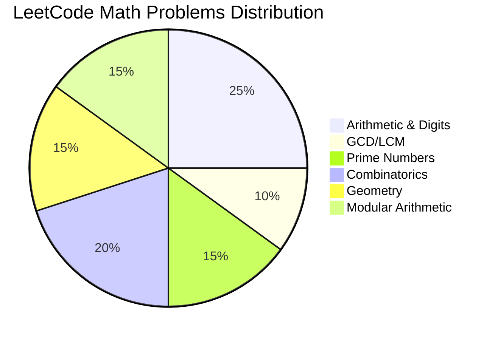

# Math Practice Problems

> **Curated problems organized by pattern and difficulty.**
>
> Practice systematically to build pattern recognition.

---

## 📊 Problem Distribution by Category

---

## 🎯 By Pattern Category

### 1. Arithmetic & Digit Manipulation

| Problem | Difficulty | Key Technique | Time |
|---------|------------|---------------|------|
| [Reverse Integer](https://leetcode.com/problems/reverse-integer/) | 🟢 Easy | Digit extraction | 15 min |
| [Palindrome Number](https://leetcode.com/problems/palindrome-number/) | 🟢 Easy | Reverse half | 10 min |
| [Happy Number](https://leetcode.com/problems/happy-number/) | 🟢 Easy | Digit sum + cycle | 15 min |
| [Add Digits](https://leetcode.com/problems/add-digits/) | 🟢 Easy | Digital root | 5 min |
| [Ugly Number](https://leetcode.com/problems/ugly-number/) | 🟢 Easy | Factor check | 10 min |
| [Ugly Number II](https://leetcode.com/problems/ugly-number-ii/) | 🟡 Medium | Three pointers | 25 min |
| [Self Dividing Numbers](https://leetcode.com/problems/self-dividing-numbers/) | 🟢 Easy | Digit iteration | 10 min |

<strong>Key Insights</strong>

**Reverse Integer:**
- Handle overflow: check before multiply
- Handle negative: work with absolute value

**Happy Number:**
- Fast & slow pointer for cycle detection
- Or use hash set to detect repeats

**Digital Root:**
- Math formula: `1 + (n - 1) % 9` for n > 0

---

### 2. GCD and LCM

| Problem | Difficulty | Key Technique | Time |
|---------|------------|---------------|------|
| [Greatest Common Divisor of Strings](https://leetcode.com/problems/greatest-common-divisor-of-strings/) | 🟢 Easy | GCD of lengths | 15 min |
| [X of a Kind in a Deck of Cards](https://leetcode.com/problems/x-of-a-kind-in-a-deck-of-cards/) | 🟢 Easy | GCD of counts | 15 min |
| [Water Bottles](https://leetcode.com/problems/water-bottles/) | 🟢 Easy | Simulation | 10 min |
| [Smallest Range I](https://leetcode.com/problems/smallest-range-i/) | 🟢 Easy | Math | 10 min |
| [Max Points on a Line](https://leetcode.com/problems/max-points-on-a-line/) | 🔴 Hard | GCD for slopes | 35 min |

<strong>Key Insights</strong>

**GCD of Strings:**
- Key: `str1 + str2 == str2 + str1` must hold
- Answer length = GCD(len1, len2)

**X of a Kind:**
- Find GCD of all card counts
- GCD must be ≥ 2

---

### 3. Prime Numbers

| Problem | Difficulty | Key Technique | Time |
|---------|------------|---------------|------|
| [Count Primes](https://leetcode.com/problems/count-primes/) | 🟡 Medium | Sieve | 20 min |
| [Perfect Number](https://leetcode.com/problems/perfect-number/) | 🟢 Easy | Divisor sum | 15 min |
| [Ugly Number](https://leetcode.com/problems/ugly-number/) | 🟢 Easy | Prime factors | 10 min |
| [Super Ugly Number](https://leetcode.com/problems/super-ugly-number/) | 🟡 Medium | Heap / DP | 25 min |
| [Prime Arrangements](https://leetcode.com/problems/prime-arrangements/) | 🟢 Easy | Sieve + nPr | 15 min |

<strong>Key Insights</strong>

**Count Primes:**
- Sieve of Eratosthenes: O(n log log n)
- Start marking from i*i

**Perfect Number:**
- Sum divisors efficiently: iterate to √n
- Include both d and n/d

---

### 4. Factorial & Powers

| Problem | Difficulty | Key Technique | Time |
|---------|------------|---------------|------|
| [Factorial Trailing Zeroes](https://leetcode.com/problems/factorial-trailing-zeroes/) | 🟡 Medium | Count 5s | 15 min |
| [Preimage Size of Factorial Zeroes Function](https://leetcode.com/problems/preimage-size-of-factorial-zeroes-function/) | 🔴 Hard | Binary search | 30 min |
| [Pow(x, n)](https://leetcode.com/problems/powx-n/) | 🟡 Medium | Fast power | 20 min |
| [Super Pow](https://leetcode.com/problems/super-pow/) | 🟡 Medium | Modular exponent | 25 min |
| [Power of Two](https://leetcode.com/problems/power-of-two/) | 🟢 Easy | Bit trick | 5 min |
| [Power of Three](https://leetcode.com/problems/power-of-three/) | 🟢 Easy | Loop or math | 10 min |

<strong>Key Insights</strong>

**Trailing Zeroes:**
- Count 5s: `n/5 + n/25 + n/125 + ...`
- 5s are limiting factor (more 2s than 5s)

**Pow(x, n):**
- Handle negative n: x → 1/x, n → -n
- Binary exponentiation: O(log n)

---

### 5. Combinatorics & Counting

| Problem | Difficulty | Key Technique | Time |
|---------|------------|---------------|------|
| [Unique Paths](https://leetcode.com/problems/unique-paths/) | 🟡 Medium | C(m+n-2, n-1) | 15 min |
| [Pascal's Triangle](https://leetcode.com/problems/pascals-triangle/) | 🟢 Easy | Build rows | 10 min |
| [Pascal's Triangle II](https://leetcode.com/problems/pascals-triangle-ii/) | 🟢 Easy | Single row | 15 min |
| [Unique Binary Search Trees](https://leetcode.com/problems/unique-binary-search-trees/) | 🟡 Medium | Catalan | 20 min |
| [Generate Parentheses](https://leetcode.com/problems/generate-parentheses/) | 🟡 Medium | Backtracking | 20 min |
| [Count Sorted Vowel Strings](https://leetcode.com/problems/count-sorted-vowel-strings/) | 🟡 Medium | Stars and Bars | 15 min |
| [Letter Tile Possibilities](https://leetcode.com/problems/letter-tile-possibilities/) | 🟡 Medium | Permutations | 25 min |

<strong>Key Insights</strong>

**Unique Paths:**
- Pure math: C(m+n-2, m-1)
- Or DP: dp[i][j] = dp[i-1][j] + dp[i][j-1]

**Unique BSTs:**
- Catalan number C(n)
- Recurrence: C(n) = Σ C(i) × C(n-1-i)

**Count Sorted Vowel Strings:**
- Stars and Bars: C(n+4, 4)

---

### 6. Geometry

| Problem | Difficulty | Key Technique | Time |
|---------|------------|---------------|------|
| [Check If It Is a Straight Line](https://leetcode.com/problems/check-if-it-is-a-straight-line/) | 🟢 Easy | Cross product | 10 min |
| [Rectangle Overlap](https://leetcode.com/problems/rectangle-overlap/) | 🟢 Easy | Interval overlap | 10 min |
| [Rectangle Area](https://leetcode.com/problems/rectangle-area/) | 🟡 Medium | Area - intersection | 15 min |
| [Valid Square](https://leetcode.com/problems/valid-square/) | 🟡 Medium | Distance check | 20 min |
| [Max Points on a Line](https://leetcode.com/problems/max-points-on-a-line/) | 🔴 Hard | GCD slopes + hash | 35 min |
| [Minimum Time Visiting All Points](https://leetcode.com/problems/minimum-time-visiting-all-points/) | 🟢 Easy | Chebyshev distance | 10 min |
| [Erect the Fence](https://leetcode.com/problems/erect-the-fence/) | 🔴 Hard | Convex hull | 40 min |

<strong>Key Insights</strong>

**Straight Line:**
- Cross product = 0 for collinear
- Avoid division for slope comparison

**Rectangle Overlap:**
- 1D overlap check in x and y
- `a1 < b2 and b1 < a2`

**Max Points:**
- GCD-normalize slopes for hashing
- Handle vertical lines separately

---

### 7. Modular Arithmetic

| Problem | Difficulty | Key Technique | Time |
|---------|------------|---------------|------|
| [Pow(x, n)](https://leetcode.com/problems/powx-n/) | 🟡 Medium | Fast power | 20 min |
| [Count Good Numbers](https://leetcode.com/problems/count-good-numbers/) | 🟡 Medium | Mod exponent | 20 min |
| [Unique Paths](https://leetcode.com/problems/unique-paths/) | 🟡 Medium | nCr with mod inverse | 15 min |
| [Super Pow](https://leetcode.com/problems/super-pow/) | 🟡 Medium | Mod exponent | 25 min |
| [Count Vowels Permutation](https://leetcode.com/problems/count-vowels-permutation/) | 🔴 Hard | Matrix exp / DP | 30 min |

<strong>Key Insights</strong>

**Count Good Numbers:**
- Even positions: 5 choices, Odd: 4 choices
- `5^(⌈n/2⌉) × 4^(⌊n/2⌋) mod 10^9+7`

**Count Vowels Permutation:**
- 5×5 transition matrix
- Matrix exponentiation for O(log n)

---

## 📈 Difficulty Progression

### Week 1: Easy Problems (Build Foundation)

| Day | Problems | Focus |
|-----|----------|-------|
| 1 | Reverse Integer, Palindrome Number | Digits |
| 2 | Happy Number, Add Digits | Digit sum |
| 3 | GCD of Strings, Power of Two | GCD, bits |
| 4 | Count Primes, Perfect Number | Sieve |
| 5 | Pascal's Triangle I & II | Combinatorics |
| 6 | Rectangle Overlap, Straight Line | Geometry |
| 7 | Review & retry struggled problems | |

### Week 2: Medium Problems (Apply Patterns)

| Day | Problems | Focus |
|-----|----------|-------|
| 1 | Pow(x, n), Super Pow | Fast power |
| 2 | Factorial Trailing Zeroes | Counting |
| 3 | Unique Paths, Unique BSTs | Combinatorics |
| 4 | Ugly Number II | Multi-pointer |
| 5 | Rectangle Area, Valid Square | Geometry |
| 6 | Count Good Numbers | Modular |
| 7 | Review & consolidate | |

### Week 3: Hard Problems (Master Edge Cases)

| Day | Problems | Focus |
|-----|----------|-------|
| 1 | Max Points on a Line | GCD + hash |
| 2 | Preimage Size of Factorial Zeroes | Binary search |
| 3 | Erect the Fence | Convex hull |
| 4 | Count Vowels Permutation | Matrix exp |
| 5 | Mixed medium review | |
| 6-7 | Contest simulation | Timed practice |

---

## 🧠 Spaced Repetition Schedule

After solving each problem:

| Review | Action |
|--------|--------|
| Day 1 | Redo without looking at solution |
| Day 3 | Explain the approach out loud |
| Day 7 | Solve a similar problem |
| Day 14 | Solve again from scratch |
| Day 30 | Can you still do it? |

---

## 📊 Problem Frequency by Company

| Company | Common Topics | Top Problems |
|---------|---------------|--------------|
| **Google** | Math, Geometry | Max Points, Count Primes |
| **Meta** | Digits, Geometry | Pow(x,n), Rectangle Overlap |
| **Amazon** | GCD, Basic math | GCD of Strings, Ugly Number |
| **Apple** | Combinatorics | Unique Paths, Pascal's Triangle |
| **Microsoft** | Primes, Factorials | Count Primes, Trailing Zeros |

---

## ✅ Problem Checklist

### Essential (Must Do)

- [ ] [Reverse Integer](https://leetcode.com/problems/reverse-integer/) - Digit manipulation
- [ ] [Palindrome Number](https://leetcode.com/problems/palindrome-number/) - Digit comparison
- [ ] [Happy Number](https://leetcode.com/problems/happy-number/) - Cycle detection
- [ ] [Count Primes](https://leetcode.com/problems/count-primes/) - Sieve of Eratosthenes
- [ ] [Pow(x, n)](https://leetcode.com/problems/powx-n/) - Fast power
- [ ] [Factorial Trailing Zeroes](https://leetcode.com/problems/factorial-trailing-zeroes/) - Count factors
- [ ] [Unique Paths](https://leetcode.com/problems/unique-paths/) - Combinatorics
- [ ] [Pascal's Triangle](https://leetcode.com/problems/pascals-triangle/) - nCr basics
- [ ] [Unique Binary Search Trees](https://leetcode.com/problems/unique-binary-search-trees/) - Catalan
- [ ] [Max Points on a Line](https://leetcode.com/problems/max-points-on-a-line/) - GCD slopes

### Recommended

- [ ] [GCD of Strings](https://leetcode.com/problems/greatest-common-divisor-of-strings/)
- [ ] [Ugly Number II](https://leetcode.com/problems/ugly-number-ii/)
- [ ] [Valid Square](https://leetcode.com/problems/valid-square/)
- [ ] [Rectangle Area](https://leetcode.com/problems/rectangle-area/)
- [ ] [Count Sorted Vowel Strings](https://leetcode.com/problems/count-sorted-vowel-strings/)

### Challenge

- [ ] [Erect the Fence](https://leetcode.com/problems/erect-the-fence/)
- [ ] [Count Vowels Permutation](https://leetcode.com/problems/count-vowels-permutation/)
- [ ] [Preimage Size of Factorial Zeroes Function](https://leetcode.com/problems/preimage-size-of-factorial-zeroes-function/)

---

## 🎯 Quick Practice by Time Available

| Time | Problems |
|------|----------|
| 15 min | Palindrome Number, Power of Two |
| 30 min | Count Primes, Pow(x,n) |
| 45 min | Unique Paths, Pascal's Triangle |
| 60 min | Max Points on a Line |
| 90 min | Erect the Fence, Count Vowels Permutation |

---

> **💡 Key Insight:** Focus on the patterns, not memorizing solutions. If you understand GCD, sieve, fast power, and basic combinatorics, you can solve 80% of math problems.

> **🔗 Related:** [Pattern Recognition](./8.1-Pattern-Recognition.md) | [Common Templates](./8.2-Common-Templates.md)
