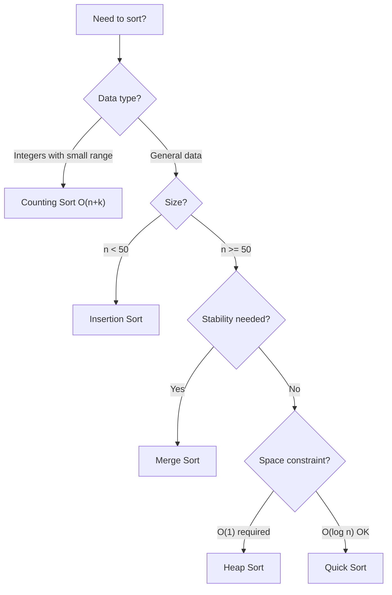

# 1.1 - Sorting Basics

> **Foundation for All Sorting Algorithms**  
> **Interview Value:** ⭐⭐⭐⭐ - Know the trade-offs  
> **Time to Learn:** 30-45 minutes

---

## Overview

Sorting is the process of arranging elements in a specific order (ascending, descending, or custom). It's one of the most fundamental operations in computer science.

**Why sorting matters:**
1. Many algorithms require sorted input (binary search, merge operations)
2. Makes searching, finding duplicates, and computing easier
3. Sorting algorithm choice affects performance significantly

---

## 🎯 Pattern Recognition

<details>
<summary><strong>When Sorting Is Needed</strong></summary>

**Keywords:**
- "Sort the array"
- "Arrange in order"
- "Find kth largest/smallest"
- "Median"
- "Merge intervals"

**Signs you might need sorting:**
- Need to use binary search later
- Finding pairs/triplets (often sort first)
- Interval problems (sort by start/end)
- Grouping similar elements

</details>

---

## ✅ When to Use Sorting

| Scenario | Why Sort | Algorithm Choice |
|----------|----------|------------------|
| Binary search needed |" O(log n) search "| Any stable O(n log n) |
| Find median | Middle element |" Quick Select O(n) or sort "|
| Interval problems | Process in order | Sort by start time |
| Two Sum variants | Enable two pointers |" O(n log n) sort + O(n) search "|
| Closest pair | Optimize search space | Sort by one dimension |

---

## ❌ When NOT to Use Sorting

| Situation | Why Not | Alternative |
|-----------|---------|-------------|
| Already sorted | Wasted work | Use directly |
| Need original order | Destroys positions | Use index array |
| Streaming data | Can't sort all at once | Heap or online algorithms |
|" O(n) possible "| Sorting is O(n log n) | Hash map, counting |
| Finding single element | Overkill | Linear scan |

---

## 🔗 Concept Map

<details>
<summary><strong>Sorting Algorithm Relationships</strong></summary>

```
Sorting Algorithms
├── Comparison-Based O(n log n) lower bound
│   ├── Simple O(n²) - good for small n
│   │   ├── Bubble Sort
│   │   ├── Selection Sort
│   │   └── Insertion Sort
│   └── Efficient O(n log n)
│       ├── Merge Sort (stable, extra space)
│       ├── Quick Sort (in-place, not stable)
│       └── Heap Sort (in-place, not stable)
└── Non-Comparison O(n)
    ├── Counting Sort (small range integers)
    ├── Radix Sort (fixed-length integers)
    └── Bucket Sort (uniform distribution)
```

</details>

---

## 📐 How Sorting Algorithms Work

### The Key Concepts

**1. Comparison-Based Sorting**
- Compares elements pairwise
- Cannot do better than O(n log n) in worst case
- Proved by decision tree argument

**2. Stable vs Unstable**
```
Original: [(3, 'a'), (1, 'b'), (3, 'c'), (2, 'd')]
Sorted by first element:

Stable:   [(1, 'b'), (2, 'd'), (3, 'a'), (3, 'c')]
          ↑ (3,'a') comes before (3,'c') - original order preserved

Unstable: [(1, 'b'), (2, 'd'), (3, 'c'), (3, 'a')]
          ↑ Original order of equal elements NOT guaranteed
```

**3. In-Place vs Extra Space**
- In-place: O(1) extra memory (swaps only)
- Extra space: Creates new arrays (easier to implement)

---

## 💻 Algorithm Comparison Table

| Algorithm | Best | Average | Worst | Space | Stable? | Use Case |
|-----------|------|---------|-------|-------|---------|----------|
| **Bubble** |" O(n) "| O(n²) |" O(n²) "| O(1) | ✅ | Educational only |
| **Selection** |" O(n²) "| O(n²) |" O(n²) "| O(1) | ❌ | Small arrays |
| **Insertion** |" O(n) "| O(n²) |" O(n²) "| O(1) | ✅ | Nearly sorted |
| **Merge** |" O(n log n) "| O(n log n) |" O(n log n) "| O(n) | ✅ | Linked lists, stable needed |
| **Quick** |" O(n log n) "| O(n log n) |" O(n²) "| O(log n) | ❌ | General purpose |
| **Heap** |" O(n log n) "| O(n log n) |" O(n log n) "| O(1) | ❌ |" In-place O(n log n) "|
| **Counting** |" O(n+k) "| O(n+k) |" O(n+k) "| O(k) | ✅ | Small integer range |
| **Radix** |" O(nk) "| O(nk) |" O(nk) "| O(n+k) | ✅ | Fixed-length numbers |

---

## 💻 Using Built-in Sort

**Python:**
```python
# Basic sorting
arr = [3, 1, 4, 1, 5, 9, 2, 6]
arr.sort()  # In-place, modifies original
print(arr)  # [1, 1, 2, 3, 4, 5, 6, 9]

sorted_arr = sorted(arr)  # Returns new list

# Descending order
arr.sort(reverse=True)

# Custom key function
words = ["banana", "pie", "Washington", "book"]
words.sort(key=len)  # Sort by length
print(words)  # ['pie', 'book', 'banana', 'Washington']

# Sort by multiple criteria
students = [("Bob", 25), ("Alice", 20), ("Bob", 20)]
# Sort by name, then by age
students.sort(key=lambda x: (x[0], x[1]))
print(students)  # [('Alice', 20), ('Bob', 20), ('Bob', 25)]

# Sort intervals by start, then by end
intervals = [[1,3], [2,6], [1,2], [8,10]]
intervals.sort(key=lambda x: (x[0], x[1]))
print(intervals)  # [[1, 2], [1, 3], [2, 6], [8, 10]]
```

**JavaScript:**
```javascript
// Basic sorting (sorts as strings by default!)
let arr = [3, 1, 4, 1, 5, 9, 2, 6];
arr.sort();  // WRONG: ['1', '1', '2', '3', '4', '5', '6', '9'] (string comparison)

// Correct numeric sort
arr.sort((a, b) => a - b);  // Ascending
console.log(arr);  // [1, 1, 2, 3, 4, 5, 6, 9]

arr.sort((a, b) => b - a);  // Descending

// Sort by custom key
const words = ["banana", "pie", "Washington", "book"];
words.sort((a, b) => a.length - b.length);

// Sort objects
const students = [
    {name: "Bob", age: 25},
    {name: "Alice", age: 20},
    {name: "Bob", age: 20}
];
students.sort((a, b) => {
    if (a.name !== b.name) return a.name.localeCompare(b.name);
    return a.age - b.age;
});

// Sort 2D array (intervals)
const intervals = [[1,3], [2,6], [1,2], [8,10]];
intervals.sort((a, b) => a[0] - b[0] || a[1] - b[1]);
```

---

## ⚡ Complexity Analysis

**Why O(n log n) is the lower bound for comparison sorts:**

```
Decision tree for sorting 3 elements:
         a < b?
        /      \
      yes       no
      /          \
   b < c?       b < c?
   /   \        /    \
  ...  ...    ...    ...

Leaves = n! (all permutations)
Height = log(n!) = O(n log n)

Therefore, minimum comparisons = O(n log n)
```

**When can we do better?**
- Non-comparison sorts (counting, radix, bucket)
- Special input properties (nearly sorted → insertion sort O(n))

---

## 🔄 Sorting Algorithm Selection Guide



### Decision Summary

| Condition | Best Choice | Why |
|-----------|-------------|-----|
| Small array (n < 50) | Insertion Sort | Low overhead |
| Nearly sorted | Insertion Sort |" O(n) best case "|
| Need stability | Merge Sort | Preserves order |
| Memory limited | Heap Sort |" O(1) space "|
| General purpose | Quick Sort | Fast in practice |
| Integers 0-k | Counting Sort |" O(n+k) "|
| Linked list | Merge Sort | No random access needed |

---

## ⚠️ Common Mistakes

### 1. JavaScript Default Sort

❌ **Wrong:**
```javascript
[10, 2, 30, 1].sort();  // Returns [1, 10, 2, 30] - string comparison!
```

✅ **Correct:**
```javascript
[10, 2, 30, 1].sort((a, b) => a - b);  // Returns [1, 2, 10, 30]
```

### 2. Modifying While Iterating

❌ **Wrong:**
```python
for i, val in enumerate(arr):
    arr.sort()  # Modifies array during iteration!
```

✅ **Correct:**
```python
arr.sort()  # Sort once before iteration
for val in arr:
    # process
```

### 3. Forgetting Stability Needs

❌ **Wrong (when stability matters):**
```python
students.sort(key=lambda x: x.gpa)  # May lose secondary ordering
```

✅ **Correct:**
```python
# Sort by multiple keys in reverse priority order
students.sort(key=lambda x: x.name)  # Secondary key first
students.sort(key=lambda x: x.gpa)   # Primary key second (stable!)
# OR
students.sort(key=lambda x: (x.gpa, x.name))  # Both at once
```

### 4. Not Considering Edge Cases

```python
def sort_safely(arr):
    if not arr or len(arr) <= 1:
        return arr
    return sorted(arr)
```

---

## 📝 Practice Problems

### Easy

| Problem | Focus | LeetCode |
|---------|-------|----------|
| Sort an Array | Implement any sort | [LC 912](https://leetcode.com/problems/sort-an-array/) |
| Squares of a Sorted Array | Two pointers + sort | [LC 977](https://leetcode.com/problems/squares-of-a-sorted-array/) |
| Merge Sorted Array | Merge technique | [LC 88](https://leetcode.com/problems/merge-sorted-array/) |

### Medium

| Problem | Focus | LeetCode |
|---------|-------|----------|
| Sort Colors | Dutch National Flag | [LC 75](https://leetcode.com/problems/sort-colors/) |
| Merge Intervals | Sort + merge | [LC 56](https://leetcode.com/problems/merge-intervals/) |
| Largest Number | Custom comparator | [LC 179](https://leetcode.com/problems/largest-number/) |
| Kth Largest Element | Quick Select | [LC 215](https://leetcode.com/problems/kth-largest-element-in-an-array/) |

### Hard

| Problem | Focus | LeetCode |
|---------|-------|----------|
| Count of Smaller Numbers After Self | Merge sort + count | [LC 315](https://leetcode.com/problems/count-of-smaller-numbers-after-self/) |

<details>
<summary><strong>🧠 Spaced Repetition Schedule</strong></summary>

**Day 1:** Learn algorithm comparison table
- Know time/space for each algorithm
- Know when each is preferred

**Day 3:** Implement Insertion Sort and Merge Sort from scratch

**Day 7:** Solve LC 912 with Quick Sort
- Understand partition logic

**Day 14:** Solve LC 56 Merge Intervals
- Custom sort + merge logic

**Day 21:** Implement Heap Sort
- Complete the set

</details>

---

## 🎤 Interview Context

<details>
<summary><strong>How to Discuss Sorting in Interviews</strong></summary>

**When asked about sorting:**
> "I'll use the built-in sort which is O(n log n). In Python/Java, it's Timsort which is a hybrid of merge sort and insertion sort."

**When asked to implement:**
> "I'll implement Quick Sort because it has good average-case performance and is in-place. I'll use randomized pivot to avoid worst-case O(n²)."

**Trade-off discussion:**
> "Merge sort guarantees O(n log n) and is stable, but needs O(n) extra space. Quick sort is in-place but not stable and has O(n²) worst case. Heap sort is in-place and O(n log n) but not stable and has poor cache performance."

**Company Focus:**

| Company | What They Ask |
|---------|---------------|
| All | Know trade-offs |
| Google | Implement Quick/Merge Sort |
| Amazon | Custom comparators |
| Meta | Stability, sorting objects |

</details>

---

## ⏱️ Time Estimates

| Activity | Time | Notes |
|----------|------|-------|
| Learn comparison table | 15-20 min | Memorize trade-offs |
| Implement Insertion Sort | 10-15 min | Simplest |
| Implement Merge Sort | 20-30 min | Divide & conquer |
| Implement Quick Sort | 25-35 min | Partition logic |
| Master custom comparators | 20-30 min | Key skill |
| LC 56 Merge Intervals | 20-25 min | Common pattern |

---

## 💡 Key Insight

> **Know the trade-offs, not just the algorithms:**
>
> | Need | Choose |
> |------|--------|
> | Stability | Merge Sort |
> | In-place | Quick/Heap Sort |
> |" Guaranteed O(n log n) "| Merge/Heap Sort |
> | Best average case | Quick Sort |
> | Nearly sorted data | Insertion Sort |
> | Small integer range | Counting Sort |
>
> In interviews, using built-in `sort()` is usually fine. Know when NOT to use it.

---

## 🔗 Related

- [Basic Sorting Algorithms](./1.2-Basic-Sorting/01-Bubble-Selection-Insertion.md) - O(n²) algorithms
- [Merge Sort](./1.3-Merge-Sort.md) - Divide and conquer
- [Quick Sort](./1.4-Quick-Sort.md) - Partition approach
- [Heap Sort](./1.5-Heap-Sort.md) - Heap-based
- [Linear Time Sorting](./1.6-Linear-Time-Sorting.md) - Counting, Radix
