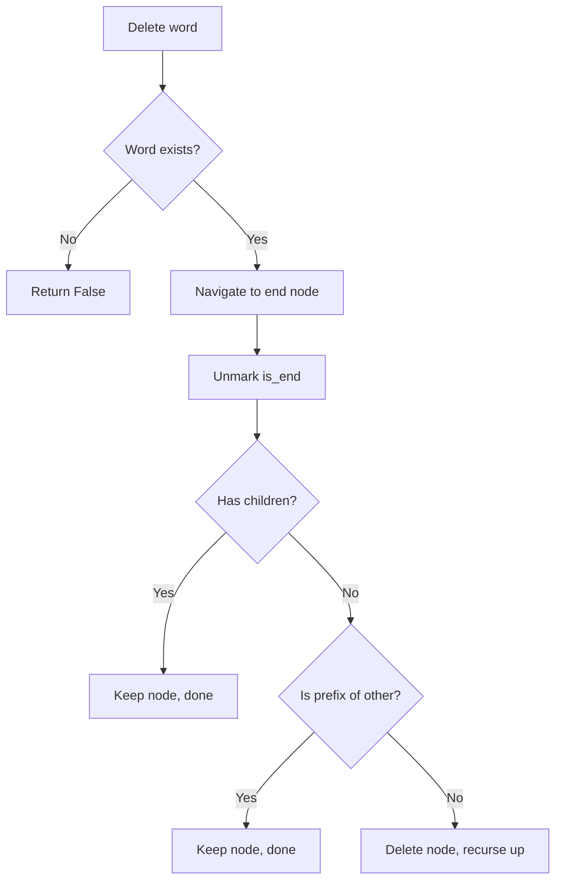

# Trie Delete Operation

> **Delete removes a word from the Trie while preserving other words that share prefixes - the trickiest Trie operation requiring careful node cleanup.**

---

## 🎯 Pattern Recognition

<details>
<summary><strong>When Delete Matters</strong></summary>

**Look for these signals:**
- "Remove word from dictionary"
- "Delete and then search"
- "Dynamic dictionary with removals"
- "Unsubscribe/remove from autocomplete"

**Delete is tricky because:**
- Must not break other words sharing the prefix
- May need to remove nodes (if no other words use them)
- Or just unmark is_end (if other words continue through)

</details>

---

## ✅ When to Use

| Scenario | Details |
|----------|---------|
| **Dynamic dictionaries** | Words added and removed over time |
| **Cache eviction** | Remove expired entries |
| **Undo operations** | Reverse an insert |
| **Memory optimization** | Remove unused branches |

---

## ❌ Delete Pitfalls

| Pitfall | Result | Solution |
|---------|--------|----------|
| **Just unmark is_end** | Leaves dead nodes | Check if branch is unused |
| **Delete all nodes** | Breaks other words | Only delete if no children |
| **Forget word check** | Delete non-existent word | Verify word exists first |
| **Not handling root** | Crash on edge cases | Never delete root |

---

## 🔗 Concept Map

<details>
<summary><strong>Prerequisites & Next Steps</strong></summary>

**Before this, you should know:**
- [Trie Operations Overview](./3.1-Insert-Operation.md) - Insert
- [Search Operation](./3.2-Search-Operation.md) - Finding words
- [Recursion basics](../../02-Recursion-Backtracking.md) - For recursive delete

**After mastering this:**
- Dynamic Trie operations
- Memory-efficient Tries
- Concurrent Trie modifications

**Delete enables:**
- Full CRUD on Tries
- Memory reclamation
- Dynamic dictionaries

</details>

---

## 📐 How It Works

### The Challenge

**Simple case - word with unique suffix:**
```
Trie: ["app", "apple"]
Delete "apple"

Before:          After:
  (root)           (root)
     │                │
     a                a
     │                │
     p                p
     │                │
     p(✓)             p(✓)
     │
     l     ← Remove these nodes!
     │
     e(✓)  ← Unmark and remove
```

**Complex case - word is prefix of another:**
```
Trie: ["app", "apple"]
Delete "app"

Before:          After:
  (root)           (root)
     │                │
     a                a
     │                │
     p                p
     │                │
     p(✓) ← Just unmark!    p ← is_end = False now
     │                │
     l                l
     │                │
     e(✓)             e(✓)
```

### The Algorithm

```
FUNCTION delete(word):
    IF word not in trie:
        Return (nothing to delete)
    
    Use recursive deletion:
        1. Navigate to end of word
        2. Unmark is_end
        3. On way back up:
           - If node has no children AND is_end = False:
             → Delete node
           - Otherwise:
             → Keep node (other words use it)
    END
```

### Decision Tree



---

## 💻 Code Implementation

### Approach 1: Recursive Delete (Clean)

**Python:**
```python
class Trie:
    def __init__(self):
        self.root = TrieNode()
    
    def delete(self, word: str) -> bool:
        """
        Delete word from trie.
        
        Time: O(m) where m = len(word)
        Space: O(m) for recursion stack
        
        Returns:
            True if word was deleted, False if not found
        """
        return self._delete_helper(self.root, word, 0)
    
    def _delete_helper(self, node: TrieNode, word: str, depth: int) -> bool:
        """
        Recursive helper for deletion.
        
        Returns True if parent should delete this node.
        """
        # Base case: reached end of word
        if depth == len(word):
            # Word doesn't exist
            if not node.is_end:
                return False
            
            # Unmark as end of word
            node.is_end = False
            
            # Return True if node can be deleted (no children)
            return len(node.children) == 0
        
        # Get next character
        char = word[depth]
        
        # Character not found - word doesn't exist
        if char not in node.children:
            return False
        
        # Recurse to child
        child = node.children[char]
        should_delete_child = self._delete_helper(child, word, depth + 1)
        
        # Delete child if it's now unused
        if should_delete_child:
            del node.children[char]
        
        # Return True if this node can also be deleted
        return not node.is_end and len(node.children) == 0
```

**JavaScript:**
```javascript
class Trie {
    constructor() {
        this.root = new TrieNode();
    }
    
    /**
     * Delete word from trie.
     * @param {string} word - Word to delete
     * @returns {boolean} - True if deleted
     */
    delete(word) {
        return this._deleteHelper(this.root, word, 0);
    }
    
    _deleteHelper(node, word, depth) {
        // Base case: reached end of word
        if (depth === word.length) {
            if (!node.isEnd) {
                return false;  // Word doesn't exist
            }
            
            node.isEnd = false;  // Unmark
            return node.children.size === 0;  // Can delete if no children
        }
        
        const char = word[depth];
        
        if (!node.children.has(char)) {
            return false;  // Word doesn't exist
        }
        
        const child = node.children.get(char);
        const shouldDeleteChild = this._deleteHelper(child, word, depth + 1);
        
        if (shouldDeleteChild) {
            node.children.delete(char);
        }
        
        return !node.isEnd && node.children.size === 0;
    }
}
```

---

### Approach 2: Iterative Delete (Explicit Stack)

**Python:**
```python
class Trie:
    def delete_iterative(self, word: str) -> bool:
        """
        Iterative delete using explicit stack.
        
        Same complexity, avoids recursion limit issues.
        """
        # First pass: verify word exists and collect path
        node = self.root
        path = [(None, self.root)]  # (char, node) pairs
        
        for char in word:
            if char not in node.children:
                return False  # Word not found
            node = node.children[char]
            path.append((char, node))
        
        # Check if it's actually a word
        if not node.is_end:
            return False
        
        # Unmark as word
        node.is_end = False
        
        # Second pass: clean up unused nodes (bottom-up)
        for i in range(len(path) - 1, 0, -1):
            char, node = path[i]
            parent = path[i - 1][1]
            
            # If node has no children and is not end of another word
            if len(node.children) == 0 and not node.is_end:
                del parent.children[char]
            else:
                break  # Stop cleanup, node is still used
        
        return True
```

---

### Approach 3: With Count Tracking

**Python:**
```python
class TrieNode:
    def __init__(self):
        self.children = {}
        self.is_end = False
        self.end_count = 0      # Number of times word ends here
        self.prefix_count = 0   # Number of words passing through

class Trie:
    def __init__(self):
        self.root = TrieNode()
    
    def insert(self, word: str) -> None:
        """Insert with count tracking."""
        node = self.root
        for char in word:
            if char not in node.children:
                node.children[char] = TrieNode()
            node = node.children[char]
            node.prefix_count += 1
        node.is_end = True
        node.end_count += 1
    
    def delete(self, word: str) -> bool:
        """
        Delete with count tracking.
        
        Handles duplicates correctly!
        """
        # Verify word exists
        node = self._traverse(word)
        if node is None or node.end_count == 0:
            return False
        
        # Decrement end count
        node.end_count -= 1
        if node.end_count == 0:
            node.is_end = False
        
        # Decrement prefix counts
        node = self.root
        for char in word:
            child = node.children[char]
            child.prefix_count -= 1
            
            # If no words use this path anymore, delete
            if child.prefix_count == 0:
                del node.children[char]
                break  # Rest of path will be garbage collected
            
            node = child
        
        return True
```

---

## ⚡ Complexity Analysis

| Operation | Time | Space | Notes |
|-----------|------|-------|-------|
| **Delete (recursive)** | O(m) | O(m) | Stack depth |
| **Delete (iterative)** | O(m) | O(m) | Path storage |
| **Delete (with count)** | O(m) | O(1) | Count decrement |

**Why O(m):**
- Navigate word once (down)
- Cleanup nodes once (up)
- Each step is O(1)

---

## 🔄 Variations

| Variation | Difference | Use Case |
|-----------|------------|----------|
| **Basic delete** | Remove word, cleanup nodes | Simple dictionary |
| **With count** | Decrement count, handle duplicates | Word frequency |
| **Soft delete** | Mark as deleted, don't cleanup | Undo support |
| **Lazy cleanup** | Cleanup later in batch | Performance |

### Soft Delete (Reversible)

```python
class Trie:
    def soft_delete(self, word: str) -> bool:
        """Mark word as deleted without removing nodes."""
        node = self._traverse(word)
        if node is None or not node.is_end:
            return False
        node.is_end = False
        return True
    
    def restore(self, word: str) -> bool:
        """Restore soft-deleted word if path still exists."""
        node = self._traverse(word)
        if node is None:
            return False  # Path was cleaned up
        node.is_end = True
        return True
```

---

## ⚠️ Common Mistakes

### 1. Deleting Nodes That Are Still Needed

**❌ Wrong:**
```python
def delete(self, word):
    node = self.root
    for char in word:
        parent = node
        node = node.children[char]
    del parent.children[word[-1]]  # Wrong! Might delete shared nodes!
```

**✅ Correct:**
```python
def delete(self, word):
    # Check if node can be deleted (no children, not end of another word)
    if len(node.children) == 0 and not node.is_end:
        del parent.children[char]
```

### 2. Forgetting to Check Word Exists

**❌ Wrong:**
```python
def delete(self, word):
    node = self._traverse(word)
    node.is_end = False  # Crash if word doesn't exist!
```

**✅ Correct:**
```python
def delete(self, word):
    node = self._traverse(word)
    if node is None or not node.is_end:
        return False  # Word doesn't exist
    node.is_end = False
    return True
```

### 3. Not Handling Root Specially

**❌ Wrong:**
```python
# If empty string is a word and we delete it
self.root = None  # Destroyed the trie!
```

**✅ Correct:**
```python
def delete(self, word):
    if not word:
        self.root.is_end = False  # Just unmark root
        return True
```

### 4. Not Cleaning Up Empty Branches

**❌ Wasteful:**
```python
def delete(self, word):
    node = self._traverse(word)
    node.is_end = False
    # Done... but leaves dead nodes!
```

**✅ Efficient:**
```python
def delete(self, word):
    # ... also clean up unused nodes on the way back
    return self._delete_helper(self.root, word, 0)
```

---

## 📝 Practice Problems

### Medium (Implement delete)
- [ ] [Implement Trie](https://leetcode.com/problems/implement-trie-prefix-tree/) - LC 208 (extend with delete)
- [ ] [Design Add and Search Words](https://leetcode.com/problems/design-add-and-search-words-data-structure/) - LC 211

### Hard (Complex trie manipulation)
- [ ] [Word Search II](https://leetcode.com/problems/word-search-ii/) - LC 212 (with optimization)
- [ ] [Implement Magic Dictionary](https://leetcode.com/problems/implement-magic-dictionary/) - LC 676

<details>
<summary><strong>🧠 Spaced Repetition Schedule</strong></summary>

For delete mastery:
- **Day 1:** Implement recursive delete, trace through examples
- **Day 3:** Implement iterative version
- **Day 7:** Add count-based delete for duplicates
- **Day 14:** Optimize Word Search II with delete
- **Day 30:** Implement full CRUD Trie from memory

</details>

---

## 🎤 Interview Context

<details>
<summary><strong>How to Discuss Delete in Interviews</strong></summary>

**Explaining the challenge:**
> "Delete is tricky because we can't just remove nodes - other words might share the same prefix. We need to check if a node has children or is the end of another word before removing it."

**Describing the approach:**
> "I'll use recursion to navigate to the word's end, unmark it as a word, then on the way back up, delete nodes that are no longer needed - those with no children and not marking another word's end."

**Optimization discussion:**
> "If we track prefix counts during insert, delete becomes simpler - just decrement counts and remove nodes when count reaches zero. This also handles duplicate words correctly."

</details>

**Interview Note:**
Delete is rarely asked directly, but understanding it shows mastery:
- Shows you understand the trie structure deeply
- Demonstrates recursion skills
- Important for Word Search II optimization

---

## ⏱️ Time Estimates

| Activity | Time | Notes |
|----------|------|-------|
| Understand delete concept | 15-20 min | This file |
| Implement recursive delete | 15-20 min | Careful with conditions |
| Implement iterative version | 20-25 min | Explicit stack |
| Add count tracking | 10-15 min | Extension |
| Master pattern | 45-60 min | Multiple variations |

---

> **💡 Key Insight:** Delete is all about knowing when nodes are still needed. Unmark is_end first, then cleanup unused nodes bottom-up. A node stays if it has children OR is end of another word.

> **🔗 Related:** [Insert Operation](./3.1-Insert-Operation.md) | [Search Operation](./3.2-Search-Operation.md) | [TrieNode Structure](../01-Trie-Fundamentals/2.1-TrieNode-Structure.md)
